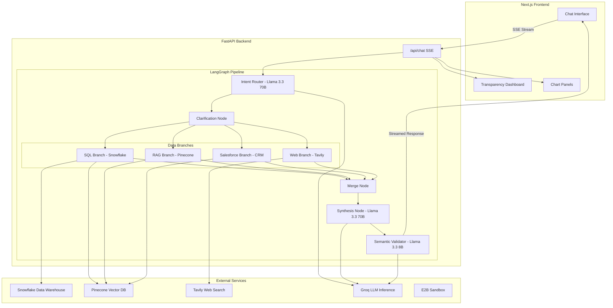
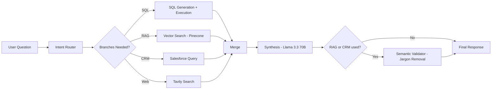
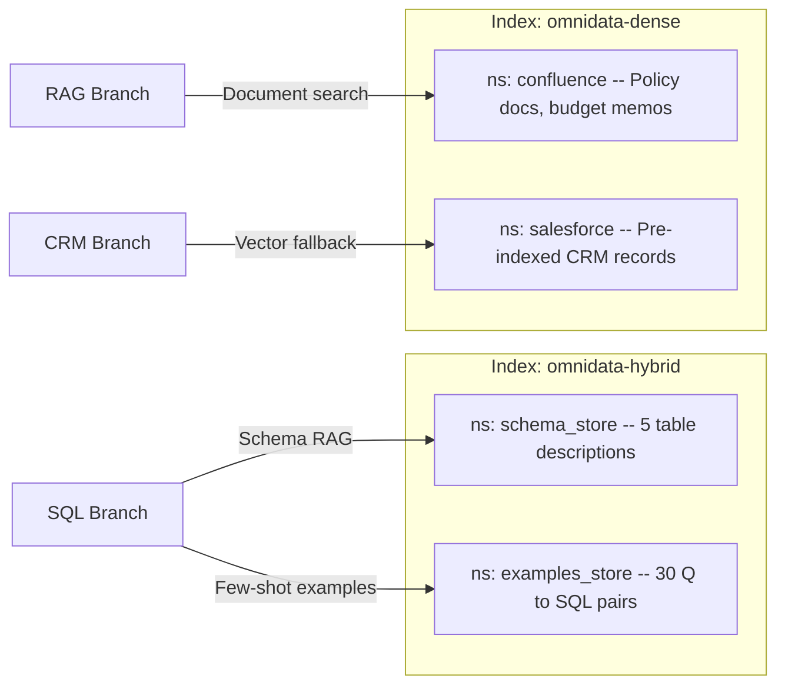
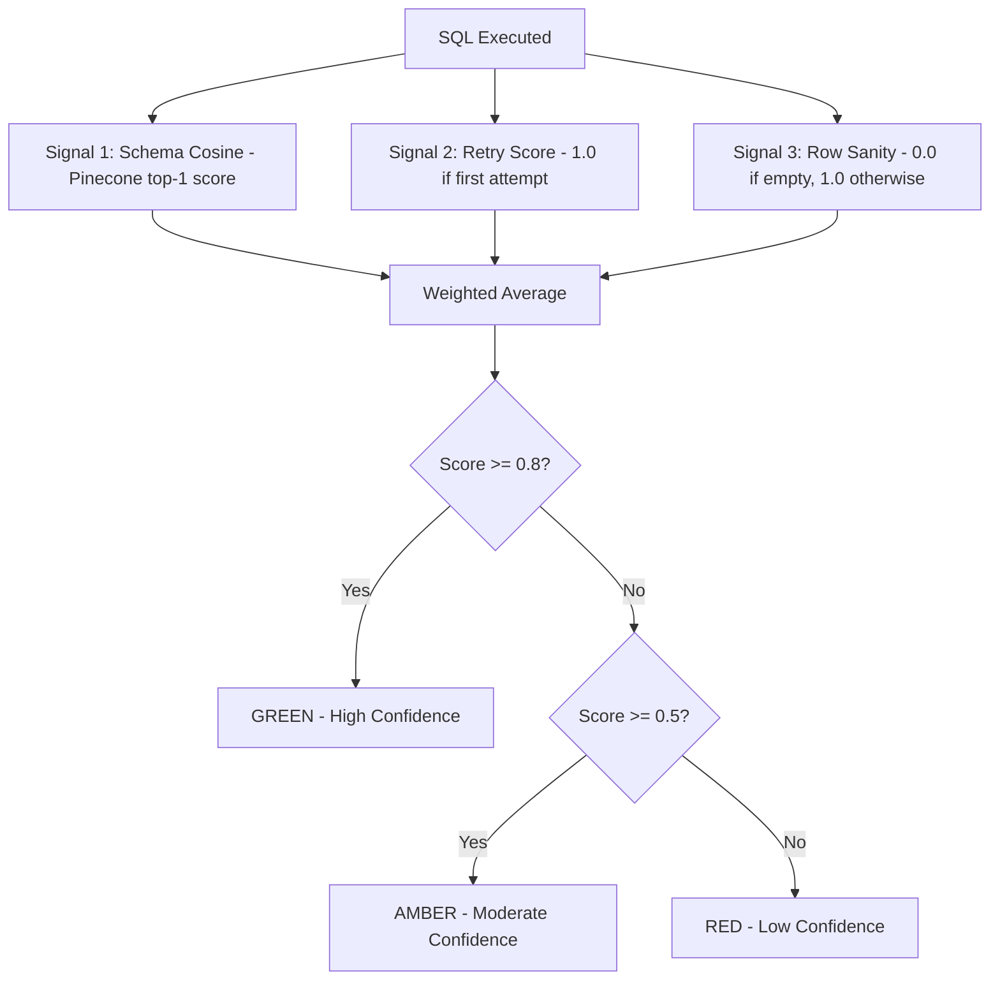

<p align="center">
  
  
  
</p>

# OmniData — AI Data Intelligence Platform

> **Talk to your enterprise data in plain English.** OmniData is a multi-agent AI system that lets business users ask natural-language questions and receive accurate, verifiable, jargon-free insights — no SQL knowledge required.

🌐 **Live Demo:** [https://code-for-purpose-frontend-635515199846.europe-west1.run.app/](https://code-for-purpose-frontend-635515199846.europe-west1.run.app/)

---

## Overview

OmniData is an enterprise-grade, multi-agent AI platform built for the **NatWest Code for Purpose: Talk to Data** hackathon. It democratises data access by allowing business users to ask questions in natural language such as *"Why did revenue drop in the South last quarter?"* and receive comprehensive, cross-referenced answers drawn from multiple enterprise data sources simultaneously. The system is designed for data analysts, business managers, and non-technical stakeholders who need quick, trustworthy insights without writing SQL or navigating complex dashboards.

The system connects to **Snowflake** for structured warehouse data, uses **Pinecone** serverless vector indexes to power schema retrieval and document search, and **Tavily** for live market intelligence. A **LangGraph** orchestration layer routes each query through the optimal combination of data branches, synthesises the results, and applies a three-layer semantic validator to strip out technical jargon — ensuring every answer is both accurate and human-readable.

---

## Demo Company: Aura Retail

All data represents **Aura Retail**, a fictional mid-sized UK omnichannel retailer selling consumer electronics across four regions (North, South, East, West) through three channels (Online, Retail, Partner). The dataset covers October 2025 to March 2026 and contains four interconnected narrative threads:

| Thread | Story | Visible In |
|--------|-------|------------|
| **South Region Crisis** | Revenue drops 28% in February 2026 due to a marketing budget cut | Snowflake (revenue data), Pinecone (indexed policy docs) |
| **North Region Success** | AuraSound Pro headphone launch drives a 34% revenue spike in Q1 | Snowflake (sales uplift), Pinecone (launch announcement) |
| **SMB Churn Wave** | Small business customers churn in March after a Partner channel price increase | Snowflake (churn metrics), Pinecone (indexed CRM records) |
| **Online Returns Spike** | Return rates hit 18% in January for Electronics due to a product defect batch | Snowflake (return data), Pinecone (returns policy doc) |

These narratives are designed so that a single complex query, such as *"Why did revenue drop?"*, triggers multiple branches and synthesises evidence from across all data sources into a unified answer.

---

## Features

### Core: SQL Intelligence (Snowflake — Live)

- **Natural Language to SQL:** Automatically generates, validates, and executes SQL queries against a live Snowflake data warehouse containing 4 tables across 4 schemas.
- **Retry with Error Correction:** If a generated SQL query fails on first execution, the system feeds the Snowflake error message back to the LLM for a corrected second attempt (up to 2 retries).
- **Auto Chart Detection:** The SQL branch automatically determines the best chart type (bar, line, doughnut) based on the shape and cardinality of the result set.
- **Multi-Chart Support:** Complex queries produce multiple chart panels (e.g., revenue by region + market share breakdown), rendered side by side.
- **Formatted Data Handling:** Charts correctly handle formatted strings containing currency symbols (£, $, €), percentage signs (%), and comma separators.

### Core: RAG Document Search (Pinecone — Live)

- **Dense Vector Retrieval:** Retrieves relevant internal documents (policy pages, launch memos, budget reports) via dense vector search on Pinecone's `omnidata-dense` index. All documents are pre-indexed from Confluence and Salesforce source data.
- **Schema-Aware SQL Generation:** The `omnidata-hybrid` index stores enriched table descriptions and 30 verified Q→SQL example pairs. Every SQL query is generated with full schema context retrieved via vector similarity.

### Core: Web Search (Tavily — Live)

- **Real-Time Market Intelligence:** Performs live web searches through the Tavily API for external benchmarks, competitor analysis, and industry context.

### Intelligent Query Routing

- **LangGraph Multi-Agent Pipeline:** An intent router powered by Llama 3.3 70B classifies each query and activates only the relevant branches (SQL-only, RAG-only, Web-only, or multi-branch combinations).
- **Sequential Chaining:** For multi-branch queries, branches execute sequentially in a deterministic chain: SQL → Salesforce → RAG → Web → Merge → Synthesis → Validator. This ensures reproducible results and allows later branches to build on earlier outputs.

### Clarification & Resolution

- **Temporal Resolution:** Automatically resolves natural-language date references like "last quarter," "Q1," or "this year" into precise SQL `WHERE` clauses with explicit date ranges.
- **Metric Resolution:** Maps ambiguous business terms (e.g., "sales," "performance," "growth") to canonical database columns using a configurable Metric Dictionary. Prompts the user for clarification when a term is genuinely ambiguous.
- **Interactive Clarification Flow:** When ambiguity is detected, the UI presents clickable clarification options (e.g., "Total Sales in GBP," "Units Sold," "New Customers") so the user can refine their query without retyping.

### Semantic Validation & Jargon Removal

- **Three-Layer Jargon Detection:** (1) Pattern-based regex detection catches `__c` fields, ALL_CAPS columns, and SQL fragments. (2) A known jargon registry loaded from `metric_dictionary.yaml` and `jargon_overrides.yaml`. (3) LLM-powered rewriting via Llama 3.3 8B naturally rephrases any remaining technical terms.
- **Configurable Overrides:** Administrators can add custom term replacements to `jargon_overrides.yaml` without touching code.
- **Substitution Audit Log:** Every jargon replacement is logged and exposed in the Language tab so judges and users can see exactly what was changed and why.

### Real-Time Streaming UI

- **Server-Sent Events (SSE):** The frontend streams responses in real time via SSE, showing partial results as each pipeline node completes.
- **Live Trace Animation:** Users see exactly which pipeline nodes are active (intent routing → clarification → SQL generation → synthesis → validation) with animated progress indicators.

### Partially Implemented: CRM & Knowledge Base

> These features are architected, coded, and seed-ready, but rely on external service connections that may not be active at demo time.

- **Salesforce CRM Branch:** Full connector code exists (`salesforce_connector.py`) with SOQL query generation. When the live Salesforce connection is unavailable (due to `simple_salesforce` package not being installed in the deployed environment), the system automatically falls back to pre-indexed CRM records stored in Pinecone's `omnidata-dense` index. CRM queries still return relevant account, case, and opportunity data via vector search.
- **Confluence Knowledge Base Branch:** Full connector code exists (`confluence_client.py`) with REST API integration. When Confluence credentials are not configured, the system falls back to pre-indexed Confluence documents in Pinecone. Document queries still return relevant policy pages and memos via vector search.

---

## The Metric Dictionary — Why Shared Definitions Matter

A core design principle of OmniData is that **every business term must have a single, unambiguous definition** shared between the AI and the organisation. This is implemented through the Metric Dictionary (`metric_dictionary.yaml`), a YAML file that acts as the semantic layer between business language and database columns.

| Metric Key | Display Name | Example Aliases | Canonical Column | Ambiguous? |
|-----------|-------------|----------------|-----------------|-----------|
| `revenue` | Total Sales | "money", "income", "earnings", "turnover" | `ACTUAL_SALES` | No |
| `units_sold` | Units Sold | "volume", "quantity", "how many" | `UNITS_SOLD` | No |
| `churn` | Customer Churn Rate | "attrition", "customers leaving" | `CHURN_RATE` | No |
| `performance` | *(ambiguous)* | "results", "numbers", "KPIs" | *(needs clarification)* | **Yes** |
| `growth` | *(ambiguous)* | "increase", "expansion" | *(needs clarification)* | **Yes** |

**How it works:**
1. When a user types "show me growth," the Metric Resolver scans the query against all aliases.
2. If the term matches a single unambiguous metric, it is resolved silently and injected into the SQL prompt.
3. If the term matches an ambiguous metric (like "growth"), the UI presents a clarification card with human-readable options.
4. The Semantic Validator uses the same dictionary to strip jargon from the final response — replacing `ACTUAL_SALES` with "Total Sales" and `CHURN_RATE` with "Customer Churn Rate."

This ensures consistent language across every user interaction and directly addresses the hackathon's Learning Outcome #2: *"Why shared definitions for key business terms and metrics are important."*

---

## Transparency Dashboard

The Transparency Dashboard is OmniData's core trust feature. It provides full visibility into how every answer was generated, exposing the reasoning chain, raw data, source documents, and confidence signals.

| Tab | What It Shows | When It Appears |
|-----|--------------|-----------------|
| **SQL** | The exact SQL query that was generated and executed, with syntax highlighting. Judges can copy and run the query directly against Snowflake to verify results. | Always (for SQL queries) |
| **DATA** | The raw data rows returned from Snowflake, presented in a scrollable table with all columns visible. | Always (for SQL queries) |
| **DOCS** | Retrieved Confluence/RAG documents with title, space key, relevance score, and text excerpt. Shows exactly which documents influenced the answer. | When RAG branch is activated |
| **WEB** | External web search results from Tavily with source URLs, content previews, and relevance scores. | When Web branch is activated |
| **CRM** | Salesforce records (accounts, cases, opportunities) surfaced by the CRM branch, with account names and relevance scores. | When Salesforce branch is activated |
| **CONTEXT** | The full resolved query context: temporal resolution details, metric mappings, and enriched prompt sent to the LLM. | Always |
| **CONF.** | A three-signal confidence score with tier rating. Signals: Schema Cosine (Pinecone top-1 RAG score), Retry Score (1.0 if SQL succeeded on first attempt), Row Sanity (1.0 if results are non-empty). Displayed as Green (≥0.8) / Amber (0.5–0.79) / Red (<0.5) with a plain-English explanation. | Always (for SQL queries) |
| **LANGUAGE** | A full audit log of every jargon substitution made by the Semantic Validator — showing the original technical term, what it was replaced with, and where in the response it appeared. | When Semantic Validator fires |

---

## Architecture

### System Architecture



### Query Pipeline Flow



### Pinecone Vector Architecture



### Confidence Scoring



---

## Tech Stack

| Layer | Technology | Purpose |
|-------|-----------|---------|
| **Frontend** | Next.js 14, React 18, TypeScript | Single-page chat interface with SSE streaming |
| **Styling** | Tailwind CSS 3, Lucide Icons | Dark-themed, responsive UI |
| **Charts** | Chart.js, react-chartjs-2 | Interactive bar, line, and doughnut charts |
| **State** | Zustand | Lightweight global state management |
| **Backend** | FastAPI, Uvicorn, Python 3.11 | REST + SSE API server |
| **Orchestration** | LangGraph | Multi-agent pipeline with conditional branching |
| **LLM Inference** | Groq API (Llama 3.3 70B & 8B) | Intent routing, SQL generation, synthesis, validation |
| **Vector Database** | Pinecone Serverless (2 indexes, 4 namespaces) | Schema RAG, document retrieval, CRM fallback |
| **Data Warehouse** | Snowflake (4 tables, 4 schemas) | Structured business data (sales, returns, customers, products) |
| **Web Search** | Tavily API | Real-time external market intelligence |
| **Deployment** | Google Cloud Run, Docker | Serverless container hosting |
| **Code Sandbox** | E2B | Isolated code execution environment |

---

## Usage Examples

### Example 1: Simple SQL Query

**Input:**
> "What were total sales last quarter?"

**What happens:** Intent router activates SQL-only branch → temporal resolver converts "last quarter" to `Q1 2026 (Jan 1 – Mar 31)` → SQL generated and executed against Snowflake → bar chart rendered by region.

**Output:** A narrative answer like *"Total sales for Q1 2026 were £4.2M across all regions, with North leading at £1.5M driven by the AuraSound Pro launch."* accompanied by a bar chart and the exact SQL visible in the Transparency Dashboard's SQL tab.

---

### Example 2: Hybrid Multi-Source Query

**Input:**
> "Why did South region revenue drop and what does our policy say about budget reallocation?"

**What happens:** Intent router activates SQL + RAG branches → SQL pulls revenue data showing the 28% South drop → RAG retrieves the budget reallocation memo from Pinecone's document index → synthesis merges both into a unified narrative.

**Output:** *"South region revenue declined 28% in February 2026 due to a marketing budget cut approved in January. According to the 'Regional Budget Reallocation' policy document, budget redistribution requires quarterly board approval..."*

---

### Example 3: Ambiguous Query with Clarification

**Input:**
> "Show me growth"

**What happens:** Metric resolver detects that "growth" is ambiguous (could mean revenue growth, unit growth, or customer growth) → clarification card presented.

**Output:** A clickable card asking *"Which metric do you mean?"* with options like "Total Sales in GBP," "Units Sold," "New Customers." The user clicks one and the query proceeds with the resolved metric.

---

## Install & Run

> 🌐 **You can see the full working project live here without any setup:**
> [https://code-for-purpose-frontend-635515199846.europe-west1.run.app/](https://code-for-purpose-frontend-635515199846.europe-west1.run.app/)

If you want to run OmniData locally, follow these steps:

### Prerequisites

- Python 3.11+
- Node.js 20+
- npm 9+
- A Snowflake account (30-day free trial works)
- A Pinecone account (free Starter plan)
- A Groq API account (free tier)
- A Tavily API account (free tier, 1k requests/month)

### 1. Clone the Repository

```bash
git clone https://github.com/Yugansh5013/code_for_purpose.git
cd code_for_purpose
```

### 2. Set Up Environment Variables

Copy the example environment file and fill in your credentials:

```bash
cp .env.example .env
```

The full `.env.example` file contains all required variables with explanations:

```env
# ============================================
# OmniData — Environment Variables
# ============================================

# Groq — Three API keys rotated per-request to avoid rate limits.
# Get keys at: https://console.groq.com/keys
GROQ_API_KEY_1=gsk_xxxxxxxxxxxxxxxxxxxx
GROQ_API_KEY_2=gsk_xxxxxxxxxxxxxxxxxxxx
GROQ_API_KEY_3=gsk_xxxxxxxxxxxxxxxxxxxx

# Pinecone — Two serverless indexes (created in step 3 below).
# Get your API key at: https://app.pinecone.io
PINECONE_API_KEY=pcsk_xxxxxxxxxxxxxxxxxxxx
PINECONE_HYBRID_INDEX=omnidata-hybrid
PINECONE_DENSE_INDEX=omnidata-dense

# Snowflake — Create a free trial at: https://signup.snowflake.com
# The account identifier looks like: abc12345.us-east-1
SNOWFLAKE_ACCOUNT=xxxxxxx.region.cloud
SNOWFLAKE_USER=your_username
SNOWFLAKE_PASSWORD=your_password
SNOWFLAKE_WAREHOUSE=COMPUTE_WH
SNOWFLAKE_DATABASE=OMNIDATA_DB

# E2B — Code execution sandbox.
# Get a key at: https://e2b.dev
E2B_API_KEY=e2b_xxxxxxxxxxxxxxxxxxxx

# Tavily — Web search API for external intelligence.
# Get a key at: https://tavily.com
TAVILY_API_KEY=tvly_xxxxxxxxxxxxxxxxxxxx

# Salesforce (Optional) — If you have a Salesforce Developer Edition.
# Leave blank to use vector fallback mode (pre-indexed records in Pinecone).
SALESFORCE_USERNAME=
SALESFORCE_PASSWORD=
SALESFORCE_SECURITY_TOKEN=
SALESFORCE_INSTANCE_URL=

# Confluence (Optional) — If you have a Confluence Cloud instance.
# Leave blank to use vector fallback mode (pre-indexed docs in Pinecone).
CONFLUENCE_BASE_URL=https://yourorg.atlassian.net
CONFLUENCE_API_TOKEN=
CONFLUENCE_USER_EMAIL=
CONFLUENCE_DEFAULT_SPACE=AURA
```

### 3. Create Pinecone Indexes

Before seeding data, you must create the two indexes in the Pinecone dashboard (https://app.pinecone.io):

1. **Index: `omnidata-hybrid`** — Dimensions: 1024, Metric: cosine, Model: `multilingual-e5-large` (integrated inference). This stores schema descriptions and SQL examples.
2. **Index: `omnidata-dense`** — Dimensions: 1024, Metric: cosine, Model: `multilingual-e5-large` (integrated inference). This stores Confluence documents and Salesforce records.

### 4. Create Snowflake Database & Schemas

In your Snowflake worksheet, run these statements before seeding:

```sql
CREATE DATABASE IF NOT EXISTS OMNIDATA_DB;
CREATE SCHEMA IF NOT EXISTS OMNIDATA_DB.SALES;
CREATE SCHEMA IF NOT EXISTS OMNIDATA_DB.PRODUCTS;
CREATE SCHEMA IF NOT EXISTS OMNIDATA_DB.RETURNS;
CREATE SCHEMA IF NOT EXISTS OMNIDATA_DB.CUSTOMERS;
```

### 5. Seed the Data

```bash
cd backend
python -m venv venv
venv\Scripts\activate        # Windows
# source venv/bin/activate   # macOS/Linux
pip install -r requirements.txt
```

Run each seed script in order:

```bash
# Seed Snowflake tables (creates tables and inserts ~2,000 rows)
python -m seed.snowflake_seed
# Expected output:
#   ✓ Created AURA_SALES (2,160 rows)
#   ✓ Created PRODUCT_CATALOGUE (30 rows)
#   ✓ Created RETURN_EVENTS (450 rows)
#   ✓ Created CUSTOMER_METRICS (72 rows)

# Seed Pinecone indexes (embeds schema + SQL examples)
python -m seed.pinecone_seed
# Expected output:
#   ✓ Connected to Pinecone index: omnidata-hybrid
#   ✓ schema_store seeded
#   ✓ examples_store seeded
#   ✓ Pinecone seeding complete!

# Seed Pinecone with Confluence documents (pre-indexes for RAG fallback)
python -m seed.confluence_seed
# Expected output:
#   ✓ Seeded X documents to omnidata-dense/confluence

# Seed Pinecone with Salesforce records (pre-indexes for CRM fallback)
python -m seed.salesforce_seed
# Expected output:
#   ✓ Seeded X records to omnidata-dense/salesforce
```

### 6. Start the Backend

```bash
cd backend
uvicorn src.main:app --reload --port 8000
```

The API server will be available at `http://localhost:8000`. You should see:

```
OmniData backend ready!
Groq pool: 3 keys
Snowflake: connected
LangGraph pipeline compiled successfully (Phase 3: SQL + Salesforce + RAG + Web + Validator)
```

### 7. Start the Frontend

```bash
cd frontend
npm install
```

Create a `.env.local` file pointing to the backend:

```env
NEXT_PUBLIC_API_URL=http://localhost:8000
```

Start the development server:

```bash
npm run dev
```

The frontend will be available at `http://localhost:3000`.

---

## Project Structure

```
code_for_purpose/
├── backend/
│   ├── src/
│   │   ├── api/                  # Frontend adapter (SSE streaming, route translation)
│   │   ├── branches/             # Data branch nodes (SQL, RAG, Salesforce, Web)
│   │   ├── clarification/        # Temporal resolver, metric resolver, clarification flow
│   │   ├── config/
│   │   │   ├── metric_dictionary.yaml  # Semantic layer: aliases → columns
│   │   │   ├── jargon_overrides.yaml   # Custom jargon replacement rules
│   │   │   ├── groq_keys.py           # API key rotation pool
│   │   │   └── settings.py            # Pydantic settings loader
│   │   ├── connectors/           # Confluence REST client, Salesforce connector
│   │   ├── router/               # LLM-powered intent router
│   │   ├── sandbox/              # E2B code execution sandbox
│   │   ├── synthesis/            # Multi-source answer synthesis
│   │   ├── validation/           # 3-layer semantic jargon validator
│   │   ├── vector/               # Pinecone client, schema store, examples store
│   │   ├── warehouse/            # Snowflake connector
│   │   ├── graph.py              # LangGraph pipeline wiring
│   │   ├── main.py               # FastAPI app entry point
│   │   └── state.py              # Typed graph state definition (GraphState)
│   ├── seed/                     # Data seeding scripts for all services
│   ├── requirements.txt
│   └── Dockerfile
├── frontend/
│   ├── app/
│   │   ├── components/           # 19 React components
│   │   │   ├── tabs/             # Transparency tabs (SQL, Data, Docs, Confidence, etc.)
│   │   │   └── ...               # Chat, Charts, Sidebar, Topbar, etc.
│   │   ├── page.tsx              # Main application page
│   │   ├── layout.tsx            # Root layout
│   │   └── globals.css           # Global styles and design tokens
│   ├── lib/
│   │   ├── store.ts              # Zustand global state (30+ state properties)
│   │   └── types.ts              # 35 TypeScript type definitions
│   ├── package.json
│   └── Dockerfile
├── cloudbuild.yaml               # GCP Cloud Build deployment pipeline
├── .env.example                  # Complete environment template with comments
└── prd.md                        # Full Product Requirements Document
```

---

## Limitations

- **Salesforce & Confluence Live Connections:** Both CRM and knowledge base branches are fully coded but currently operate in **vector fallback mode** in the deployed environment. They return relevant pre-indexed results from Pinecone rather than live API queries. See the "Partially Implemented" section in Features for details.
- **Conversation Memory:** Chat history is session-scoped. Refreshing the page clears the conversation. There is no persistent chat history across sessions.
- **LLM Rate Limits:** Heavy concurrent usage may hit Groq API rate limits. The backend rotates across three API keys to mitigate this, but sustained high traffic could still trigger throttling.
- **SQL Scope:** The SQL branch can only query the four pre-defined tables in `OMNIDATA_DB`. It cannot discover or query arbitrary Snowflake databases.
- **Single Language:** The interface and all LLM prompts are English-only.

---

## Future Improvements

- **Persistent Chat History:** Add database-backed session storage so conversations survive page refreshes.
- **Voice Input:** Integrate the Web Speech API for hands-free query input.
- **Live Salesforce & Confluence:** Install `simple_salesforce` and configure Confluence API tokens in the deployed environment to enable real-time SOQL and REST queries.
- **Role-Based Access Control:** Add authentication and row-level Snowflake security so different users see only the data they are authorised to access.
- **Multi-Language Support:** Extend the LLM prompts and UI to support additional languages.
- **Export Functionality:** Allow users to download query results as CSV or PDF.
- **Dashboard Pinning:** Let users save favourite queries and pin chart panels to a persistent dashboard.

---

## License & DCO Compliance

This project is licensed under the **Apache License 2.0** — see the [LICENSE](./LICENSE) file for full terms.

All commits to this repository are signed off in compliance with the [Developer Certificate of Origin (DCO)](https://developercertificate.org/) using the following format:

```
Signed-off-by: Yugansh Sharma <yugansh5013.s@gmail.com>
```

A single email address has been used throughout all commits. To verify DCO compliance:

```bash
git log --format='%ae %s' | head -20
```

---

<p align="center">
  Built with ❤️ for the <strong>NatWest Code for Purpose</strong> hackathon
</p>
