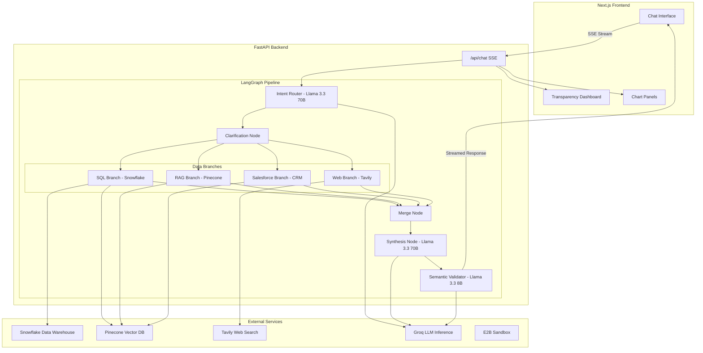
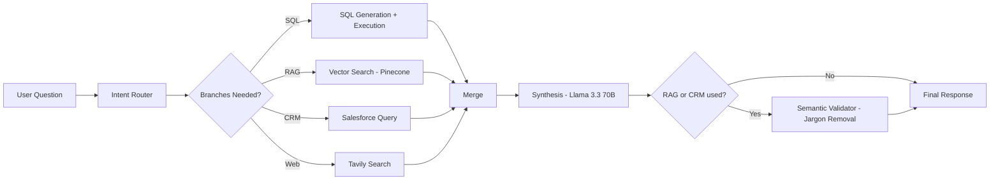
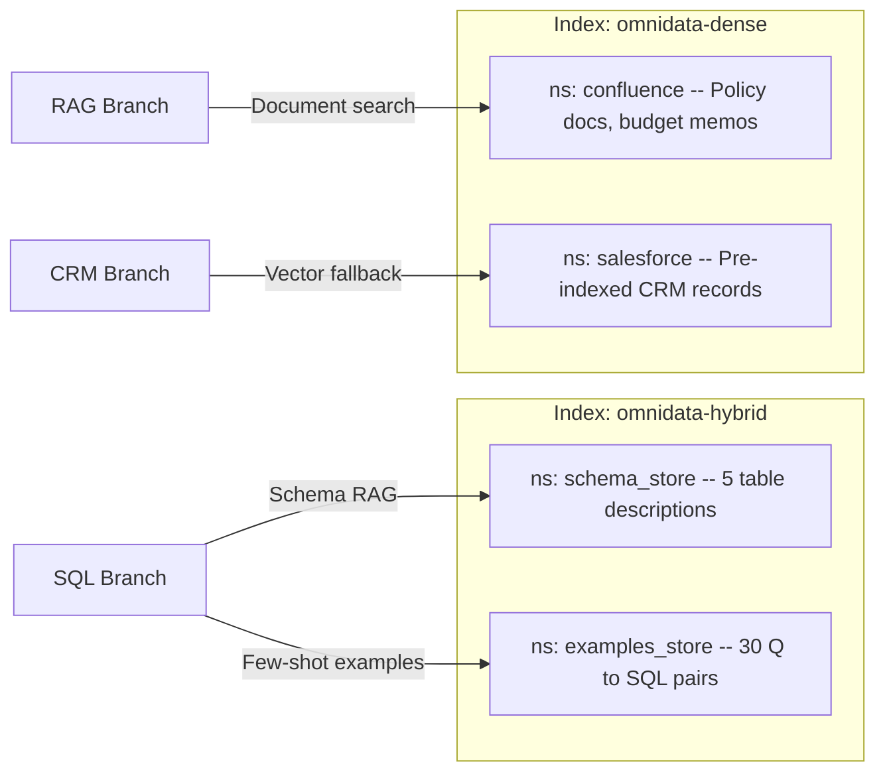
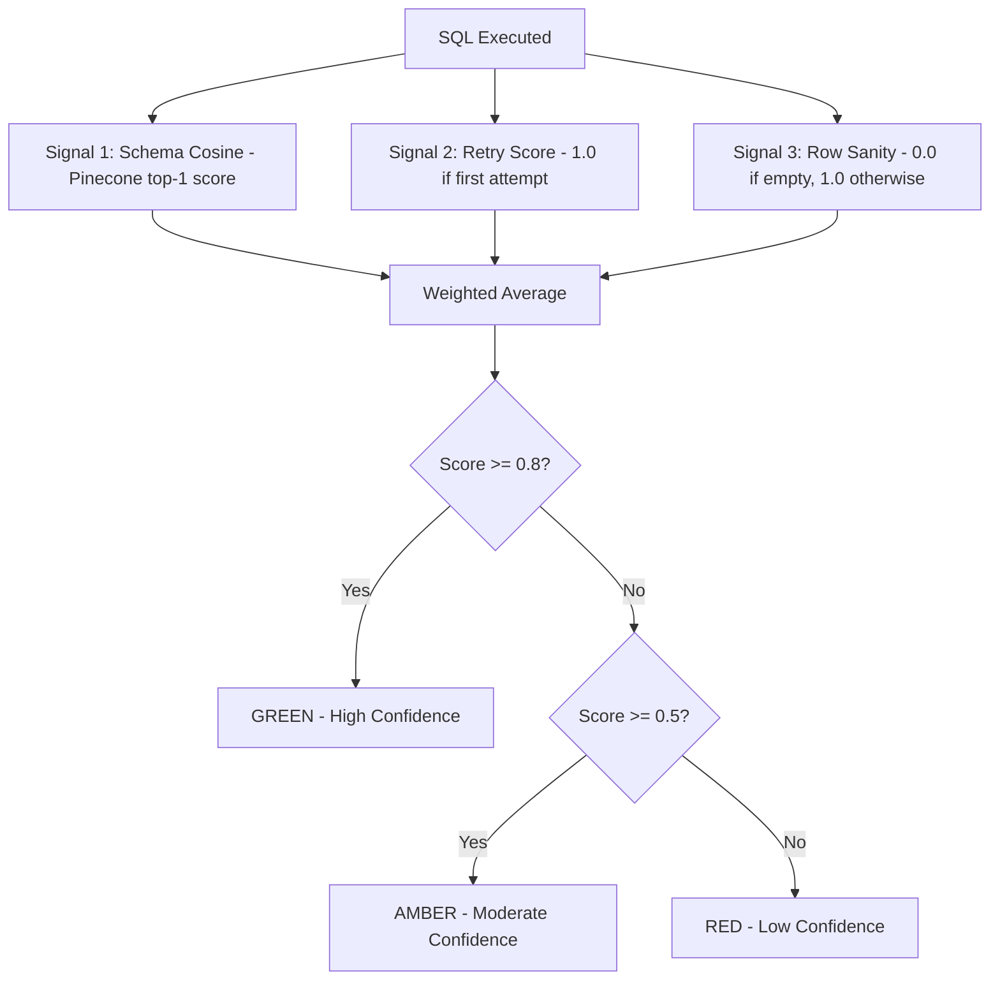

<p align="center">
  
  
  
</p>

# OmniData — AI Data Intelligence Platform

> **Talk to your enterprise data in plain English.** OmniData is a multi-agent AI system that lets business users ask natural-language questions and receive accurate, verifiable, jargon-free insights — no SQL knowledge required.

---

## Overview

OmniData is an enterprise-grade, multi-agent AI platform that democratises data access by allowing business users to ask questions in natural language — such as *"Why did revenue drop in the South last quarter?"* — and receive comprehensive, cross-referenced answers drawn from multiple enterprise data sources simultaneously. The system is designed for data analysts, business managers, and non-technical stakeholders who need quick, trustworthy insights without writing SQL or navigating complex dashboards.

The system connects to **Snowflake** for structured warehouse data, uses **Pinecone** serverless vector indexes to power schema retrieval and document search, and **Tavily** for live market intelligence. A **LangGraph** orchestration layer routes each query through the optimal combination of data branches, synthesises the results, and applies a three-layer semantic validator to strip out technical jargon — ensuring every answer is both accurate and human-readable.

---

## Demo Company: Aura Retail

All data represents **Aura Retail**, a fictional mid-sized UK omnichannel retailer selling consumer electronics across four regions (North, South, East, West) through three channels (Online, Retail, Partner). The dataset covers October 2025 to March 2026 and contains four interconnected narrative threads:

| Thread | Story | Visible In |
|--------|-------|------------|
| **South Region Crisis** | Revenue drops 28% in February 2026 due to a marketing budget cut | Snowflake (revenue data), Pinecone (indexed policy docs) |
| **North Region Success** | AuraSound Pro headphone launch drives a 34% revenue spike in Q1 | Snowflake (sales uplift), Pinecone (launch announcement) |
| **SMB Churn Wave** | Small business customers churn in March after a Partner channel price increase | Snowflake (churn metrics), Pinecone (indexed CRM records) |
| **Online Returns Spike** | Return rates hit 18% in January for Electronics due to a product defect batch | Snowflake (return data), Pinecone (returns policy doc) |

These narratives are designed so that a single complex query, such as *"Why did revenue drop?"*, triggers multiple branches and synthesises evidence from across all data sources into a unified answer.

---

## Features

### Core: SQL Intelligence (Snowflake — Live)

- **Natural Language to SQL:** Automatically generates, validates, and executes SQL queries against a live Snowflake data warehouse containing 4 tables across 4 schemas.
- **Retry with Error Correction:** If a generated SQL query fails on first execution, the system feeds the Snowflake error message back to the LLM for a corrected second attempt (up to 2 retries).
- **Query Decomposition:** Complex multi-dimensional questions are automatically decomposed into 2-3 focused sub-queries that execute independently and merge results.
- **Auto Visualization (E2B Sandbox):** AI-generated Python code runs in an isolated E2B cloud sandbox to produce Plotly charts. The system selects the optimal chart type based on data shape and generates publication-quality, themed visualizations.
- **Multi-Chart Support:** Complex queries produce multiple chart panels (e.g., revenue by region + churn by segment), rendered side by side with interactive Plotly JSON.
- **Self-Healing SQL:** Domain experts can correct AI-generated SQL queries and save corrections to a Pinecone vector store. Future similar questions automatically retrieve the corrected pattern, making the system smarter with every human correction.

### Core: RAG Document Search (Pinecone — Live)

- **Dense Vector Retrieval:** Retrieves relevant internal documents (policy pages, launch memos, budget reports) via dense vector search on Pinecone's `omnidata-dense` index. All documents are pre-indexed from Confluence and Salesforce source data.
- **Schema-Aware SQL Generation:** The `omnidata-hybrid` index stores enriched table descriptions and 30 verified Q→SQL example pairs. Every SQL query is generated with full schema context retrieved via vector similarity.

### Core: Web Search (Tavily — Live)

- **Real-Time Market Intelligence:** Performs live web searches through the Tavily API for external benchmarks, competitor analysis, and industry context.

### Intelligent Query Routing

- **LangGraph Multi-Agent Pipeline:** An intent router powered by Llama 3.3 70B classifies each query and activates only the relevant branches (SQL-only, RAG-only, Web-only, or multi-branch combinations).
- **Sequential Chaining:** For multi-branch queries, branches execute sequentially in a deterministic chain: SQL → Salesforce → RAG → Web → Merge → Synthesis → Validator. This ensures reproducible results and allows later branches to build on earlier outputs.
- **API Key Resilience:** The Groq key pool automatically rotates across 3 API keys. On a 429 rate-limit error, the system retries with the next key — ensuring zero downtime during heavy usage.

### Clarification & Resolution

- **Temporal Resolution:** Automatically resolves natural-language date references like "last quarter," "Q1," or "this year" into precise SQL `WHERE` clauses with explicit date ranges.
- **Metric Resolution:** Maps ambiguous business terms (e.g., "sales," "performance," "growth") to canonical database columns using a configurable Metric Dictionary. Prompts the user for clarification when a term is genuinely ambiguous.
- **Interactive Clarification Flow:** When ambiguity is detected, the UI presents clickable clarification options (e.g., "Total Sales in GBP," "Units Sold," "New Customers") so the user can refine their query without retyping.

### Semantic Validation & Jargon Removal

- **Three-Layer Jargon Detection:** (1) Pattern-based regex detection catches `__c` fields, ALL_CAPS columns, and SQL fragments. (2) A known jargon registry loaded from `metric_dictionary.yaml` and `jargon_overrides.yaml`. (3) LLM-powered rewriting via Llama 3.3 8B naturally rephrases any remaining technical terms.
- **Configurable Overrides:** Administrators can add custom term replacements to `jargon_overrides.yaml` without touching code.
- **Substitution Audit Log:** Every jargon replacement is logged and exposed in the Language tab so users can see exactly what was changed and why.

### Real-Time Streaming UI

- **Server-Sent Events (SSE):** The frontend streams responses in real time via SSE, showing partial results as each pipeline node completes.
- **Live Trace Animation:** Users see exactly which pipeline nodes are active (intent routing → clarification → SQL generation → synthesis → validation) with animated progress indicators.

### Role-Based Access Control (RBAC)

- **Region-Level Data Scoping:** Different user roles see different data. A North Region Manager can only query North region data — even if they ask for "all regions," the AI acknowledges the restriction and offers to show their authorized region instead.
- **Synthesis-Layer Enforcement:** Access rules are enforced at the synthesis layer, not just the UI — preventing data leakage through prompt manipulation.

### File Upload

- **Ad-Hoc Data Analysis:** Users can upload CSV, Excel, or PDF files directly into the chat. The AI reads the file structure and allows natural-language queries against the uploaded data — no schema setup required.

### CRM & Knowledge Base

- **Salesforce CRM Branch:** Full connector with SOQL query generation. Includes Pinecone vector-search as the primary retrieval method, with live SOQL fallback when the Salesforce connection is active. CRM queries return relevant account, case, and opportunity data.
- **Confluence Knowledge Base Branch:** Full connector with REST API integration. Pre-indexed Confluence documents are retrieved via Pinecone RAG with source citations, document titles, and relevance scores.

---

## The Metric Dictionary — Why Shared Definitions Matter

A core design principle of OmniData is that **every business term must have a single, unambiguous definition** shared between the AI and the organisation. This is implemented through the Metric Dictionary (`metric_dictionary.yaml`), a YAML file that acts as the semantic layer between business language and database columns.

The dictionary currently defines **12 metrics** with **93 natural-language aliases**, covering revenue, units, churn, returns, ad spend, discounts, and more.

| Metric Key | Display Name | Example Aliases | Canonical Column | Ambiguous? |
|-----------|-------------|----------------|-----------------|-----------|
| `revenue` | Total Sales | "money", "income", "earnings", "turnover" | `ACTUAL_SALES` | No |
| `units_sold` | Units Sold | "volume", "quantity", "how many" | `UNITS_SOLD` | No |
| `churn` | Customer Churn Rate | "attrition", "customers leaving", "drop-off" | `CHURN_RATE` | No |
| `return_rate` | Return Rate | "returns", "refunds rate", "how many came back" | `RETURN_RATE` | No |
| `performance` | *(ambiguous)* | "results", "numbers", "KPIs" | *(needs clarification)* | **Yes** |

**How it works:**
1. When a user types "show me growth," the Metric Resolver scans the query against all aliases.
2. If the term matches a single unambiguous metric, it is resolved silently and injected into the SQL prompt.
3. If the term matches an ambiguous metric (like "growth"), the UI presents a clarification card with human-readable options.
4. The Semantic Validator uses the same dictionary to strip jargon from the final response — replacing `ACTUAL_SALES` with "Total Sales" and `CHURN_RATE` with "Customer Churn Rate."

This ensures consistent language across every user interaction — embodying the principle that shared definitions for key business terms and metrics are essential for trustworthy AI.

---

## Transparency Dashboard

The Transparency Dashboard is OmniData's core trust feature. It provides full visibility into how every answer was generated, exposing the reasoning chain, raw data, source documents, and confidence signals.

| Tab | What It Shows | When It Appears |
|-----|--------------|-----------------|
| **SQL** | The exact SQL query that was generated and executed, with syntax highlighting. Users can copy and run the query directly against Snowflake to verify results. | Always (for SQL queries) |
| **DATA** | The raw data rows returned from Snowflake, presented in a scrollable table with all columns visible. | Always (for SQL queries) |
| **DOCS** | Retrieved Confluence/RAG documents with title, space key, relevance score, and text excerpt. Shows exactly which documents influenced the answer. | When RAG branch is activated |
| **WEB** | External web search results from Tavily with source URLs, content previews, and relevance scores. | When Web branch is activated |
| **CRM** | Salesforce records (accounts, cases, opportunities) surfaced by the CRM branch, with account names and relevance scores. | When Salesforce branch is activated |
| **CONTEXT** | The full resolved query context: temporal resolution details, metric mappings, and enriched prompt sent to the LLM. | Always |
| **CONF.** | A three-signal confidence score with tier rating. Signals: Schema Cosine (Pinecone top-1 RAG score), Retry Score (1.0 if SQL succeeded on first attempt), Row Sanity (1.0 if results are non-empty). Displayed as Green (≥0.8) / Amber (0.5–0.79) / Red (<0.5) with a plain-English explanation. | Always (for SQL queries) |
| **LANGUAGE** | A full audit log of every jargon substitution made by the Semantic Validator — showing the original technical term, what it was replaced with, and where in the response it appeared. | When Semantic Validator fires |

---

## Architecture

### System Architecture



### Query Pipeline Flow



### Pinecone Vector Architecture



### Confidence Scoring



---

## Tech Stack

| Layer | Technology | Purpose |
|-------|-----------|---------|
| **Frontend** | Next.js 14, React 18, TypeScript | Single-page chat interface with SSE streaming |
| **Styling** | Tailwind CSS 3, Material Symbols, Lucide Icons | Ethereal-themed, responsive UI |
| **Charts** | Plotly.js (via E2B) | AI-generated interactive bar, line, grouped bar, and scatter charts |
| **State** | Zustand | Lightweight global state management |
| **Backend** | FastAPI, Uvicorn, Python 3.11 | REST + SSE API server |
| **Orchestration** | LangGraph | Multi-agent pipeline with conditional branching |
| **LLM Inference** | Groq API (Llama 3.3 70B & 8B) | Intent routing, SQL generation, synthesis, validation |
| **Vector Database** | Pinecone Serverless (2 indexes, 4 namespaces) | Schema RAG, document retrieval, CRM fallback |
| **Data Warehouse** | Snowflake (4 tables, 4 schemas) | Structured business data (sales, returns, customers, products) |
| **Web Search** | Tavily API | Real-time external market intelligence |
| **Deployment** | Render (backend) + Vercel (frontend) | Docker container + serverless edge |
| **Code Sandbox** | E2B | Isolated code execution environment |

---

## Example Queries to Try

Below is a curated set of queries you can ask OmniData, organised by complexity and data source. These are designed to showcase every capability of the platform — from simple lookups to complex multi-source investigations that generate charts.

> 💡 **Tip:** Copy-paste any of these directly into the chat input. The system handles temporal resolution, metric mapping, and source routing automatically.

---

### 🟢 Simple — SQL Only (Single Table, Direct Answer)

These queries hit a single database table and return a straightforward answer. Great for getting started.

| # | Query | What It Tests |
|---|-------|---------------|
| 1 | `What were total sales last quarter?` | Temporal resolution ("last quarter" → Q1 2026), basic aggregation |
| 2 | `How many units did we sell in March?` | Simple `SUM` with date filter |
| 3 | `Show me revenue by region` | `GROUP BY` region, generates a **bar chart** |
| 4 | `What is the average order value by customer segment?` | Aggregation from `CUSTOMER_METRICS` |
| 5 | `List all active products with their prices` | Direct query on `PRODUCT_CATALOGUE` |
| 6 | `What products were launched in 2026?` | Date filter on product launch dates |
| 7 | `How many active customers do we have by region?` | `CUSTOMER_METRICS` with `GROUP BY` |
| 8 | `What was total ad spend by region last quarter?` | Marketing spend aggregation |

---

### 🟡 Medium — SQL with Joins, Trends & Charts

These queries require table joins, time-series analysis, or produce rich visualizations.

| # | Query | What It Tests |
|---|-------|---------------|
| 9 | `Show me the monthly revenue trend for the North region` | Time-series `GROUP BY` month, generates a **line chart** |
| 10 | `Which were the top 5 products by revenue last month?` | `JOIN` between `AURA_SALES` and `PRODUCT_CATALOGUE`, `LIMIT 5` |
| 11 | `What is the revenue split by sales channel this year?` | Percentage-of-total calculation with window function |
| 12 | `Compare February and March revenue for the South region` | Month-over-month comparison, generates **grouped bar chart** |
| 13 | `What is the return rate for online electronics this year?` | `RETURN_EVENTS` with channel + category filter |
| 14 | `Show me return reasons breakdown` | `GROUP BY` return reason with percentage, generates **pie/bar chart** |
| 15 | `What is our marketing ROI by region?` | Calculated metric (Revenue / Ad Spend), multi-column output |
| 16 | `Revenue comparison: online vs retail vs partner for each region` | 2D grouped aggregation, generates **grouped bar chart** |
| 17 | `What is the SMB churn trend over time?` | Segment-filtered time-series from `CUSTOMER_METRICS` |
| 18 | `How is the Partner channel trending?` | Channel-filtered monthly trend with regional breakdown |

---

### 🔴 Complex — Multi-Table, Multi-Dimensional Analysis

These queries push the SQL branch harder — requiring decomposition, multi-table joins, and advanced aggregations.

| # | Query | What It Tests |
|---|-------|---------------|
| 19 | `Which region has the highest churn rate and what is their revenue trend?` | Query decomposition: churn query + revenue trend, **multi-chart output** |
| 20 | `Show me top selling products by name with revenue and units sold` | `JOIN` + multi-column aggregation |
| 21 | `What is the average order value by region and customer segment?` | 2D `GROUP BY` on `CUSTOMER_METRICS` |
| 22 | `How does the repeat purchase rate compare across enterprise customers by region?` | Segment-filtered metric with regional breakdown |
| 23 | `What is the correlation between ad spend and revenue by region?` | Two metrics side-by-side, ROI analysis |
| 24 | `Break down returns by product, region, and reason for Q1 2026` | 3D aggregation with temporal filter |

---

### 📄 Document / RAG Only (Vector Search — No SQL)

These queries skip the database entirely and retrieve answers from internal documents indexed in Pinecone.

| # | Query | What It Retrieves |
|---|-------|-------------------|
| 25 | `What is our returns policy?` | **Customer Refund and Returns Policy v4.2** |
| 26 | `Tell me about the AuraSound Pro launch` | **AuraSound Pro Product Launch Brief** |
| 27 | `What does the SMB retention playbook recommend?` | **Customer Success — SMB Retention Playbook** |
| 28 | `What was discussed in the Q1 board summary?` | **Q1 2026 Commercial Strategy — Board Summary** |
| 29 | `What changed in the partner channel pricing?` | **Partner Channel Price Adjustment — February 2026** |
| 30 | `How are our metrics defined?` | **Data Glossary — Aura Retail Metrics Definitions** |

---

### 🔀 Hybrid — SQL + Documents (Multi-Source Synthesis)

These are the showcase queries. They trigger **multiple branches simultaneously** — pulling numbers from the database AND context from internal documents, then synthesising everything into a unified answer.

| # | Query | Branches Activated | Why It's Interesting |
|---|-------|--------------------|----------------------|
| 31 | `Why did South region revenue drop and what does our policy say about budget reallocation?` | SQL + RAG | Pulls the 28% revenue drop from database + retrieves the **Regional Marketing Budget Policy** |
| 32 | `Why are returns spiking for AuraSound Pro and what is our returns policy?` | SQL + RAG | Gets return rate data (18% in Jan) + retrieves the **Returns Policy** document |
| 33 | `What drove North region growth and what was the product launch strategy?` | SQL + RAG | Revenue uplift data + **AuraSound Pro Launch Brief** |
| 34 | `Why is SMB churn increasing and what retention actions are recommended?` | SQL + RAG | Churn data (14% in South, March) + **SMB Retention Playbook** |
| 35 | `How did the partner channel price change affect revenue?` | SQL + RAG | Partner channel revenue trend + **Partner Channel Price Adjustment** memo |

---

### 🌐 Web Search (Live External Intelligence)

These queries trigger the Tavily web search branch for real-time market context.

| # | Query | What It Does |
|---|-------|--------------|
| 36 | `What are the latest trends in UK retail electronics?` | Live web search for market intelligence |
| 37 | `How does our return rate compare to industry benchmarks?` | SQL (our return rate) + Web (industry averages) |
| 38 | `What are competitors doing in the headphone market?` | Web-only competitive intelligence |

---

### ❓ Ambiguous — Triggers Clarification Flow

These queries are intentionally vague to demonstrate the clarification system.

| # | Query | What Happens |
|---|-------|--------------|
| 39 | `Show me growth` | **Ambiguous metric** — system asks: "Do you mean Total Sales, Units Sold, or New Customers?" |
| 40 | `How are we performing?` | **Ambiguous metric** — "performance" maps to multiple KPIs, clarification card appears |
| 41 | `What are the numbers?` | **Too vague** — system prompts for specificity |

---

### 🔒 RBAC-Scoped (Role-Based Access Control)

Log in as different roles to see how the same query returns different data. Switch roles from the login page.

| # | Role | Query | What Happens |
|---|------|-------|--------------|
| 42 | **CEO** | `Show me revenue by region` | Full data — all 4 regions visible |
| 43 | **North Region Manager** | `Show me revenue by region` | **Only North data** — other regions filtered out, with a note explaining the restriction |
| 44 | **South Region Manager** | `Why did revenue drop?` | Scoped to South — shows the 28% February decline without exposing other regions |

---

### 📊 Best Queries for Chart Generation

If you want to see beautiful auto-generated Plotly charts, these queries are optimised for visual output:

| # | Query | Expected Chart Type |
|---|-------|---------------------|
| 45 | `Show me revenue by region` | **Bar chart** — 4 bars (North, South, East, West) |
| 46 | `Monthly revenue trend for all regions` | **Line chart** — multi-series trend over 6 months |
| 47 | `Revenue split by channel` | **Bar chart** — Online vs Retail vs Partner |
| 48 | `Compare monthly churn rates across customer segments` | **Grouped bar / line chart** — Enterprise vs SMB vs Consumer |
| 49 | `Top 10 products by revenue` | **Horizontal bar chart** — product leaderboard |
| 50 | `Return reasons breakdown` | **Bar chart** — Defective, Changed Mind, Wrong Item, Other |

---

## Install & Run

> 💡 **Prefer to skip local setup?** Deploy the backend to Render and the frontend to Vercel — see [Deployment](#deployment) below.

If you want to run OmniData locally, follow these steps:

### Prerequisites

- Python 3.11+
- Node.js 20+
- npm 9+
- A Snowflake account (30-day free trial works)
- A Pinecone account (free Starter plan)
- A Groq API account (free tier)
- A Tavily API account (free tier, 1k requests/month)

### 1. Clone the Repository

```bash
git clone https://github.com/Yugansh5013/code_for_purpose.git
cd code_for_purpose
```

### 2. Set Up Environment Variables

Copy the example environment file and fill in your credentials:

```bash
cp .env.example .env
```

The full `.env.example` file contains all required variables with explanations:

```env
# ============================================
# OmniData — Environment Variables
# ============================================

# Groq — Three API keys rotated per-request to avoid rate limits.
# Get keys at: https://console.groq.com/keys
GROQ_API_KEY_1=gsk_xxxxxxxxxxxxxxxxxxxx
GROQ_API_KEY_2=gsk_xxxxxxxxxxxxxxxxxxxx
GROQ_API_KEY_3=gsk_xxxxxxxxxxxxxxxxxxxx

# Pinecone — Two serverless indexes (created in step 3 below).
# Get your API key at: https://app.pinecone.io
PINECONE_API_KEY=pcsk_xxxxxxxxxxxxxxxxxxxx
PINECONE_HYBRID_INDEX=omnidata-hybrid
PINECONE_DENSE_INDEX=omnidata-dense

# Snowflake — Create a free trial at: https://signup.snowflake.com
# The account identifier looks like: abc12345.us-east-1
SNOWFLAKE_ACCOUNT=xxxxxxx.region.cloud
SNOWFLAKE_USER=your_username
SNOWFLAKE_PASSWORD=your_password
SNOWFLAKE_WAREHOUSE=COMPUTE_WH
SNOWFLAKE_DATABASE=OMNIDATA_DB

# E2B — Code execution sandbox.
# Get a key at: https://e2b.dev
E2B_API_KEY=e2b_xxxxxxxxxxxxxxxxxxxx

# Tavily — Web search API for external intelligence.
# Get a key at: https://tavily.com
TAVILY_API_KEY=tvly_xxxxxxxxxxxxxxxxxxxx

# Salesforce (Optional) — If you have a Salesforce Developer Edition.
# Leave blank to use vector fallback mode (pre-indexed records in Pinecone).
SALESFORCE_USERNAME=
SALESFORCE_PASSWORD=
SALESFORCE_SECURITY_TOKEN=
SALESFORCE_INSTANCE_URL=

# Confluence (Optional) — If you have a Confluence Cloud instance.
# Leave blank to use vector fallback mode (pre-indexed docs in Pinecone).
CONFLUENCE_BASE_URL=https://yourorg.atlassian.net
CONFLUENCE_API_TOKEN=
CONFLUENCE_USER_EMAIL=
CONFLUENCE_DEFAULT_SPACE=AURA
```

### 3. Create Pinecone Indexes

Before seeding data, you must create the two indexes in the Pinecone dashboard (https://app.pinecone.io):

1. **Index: `omnidata-hybrid`** — Dimensions: 1024, Metric: cosine, Model: `multilingual-e5-large` (integrated inference). This stores schema descriptions and SQL examples.
2. **Index: `omnidata-dense`** — Dimensions: 1024, Metric: cosine, Model: `multilingual-e5-large` (integrated inference). This stores Confluence documents and Salesforce records.

### 4. Create Snowflake Database & Schemas

In your Snowflake worksheet, run these statements before seeding:

```sql
CREATE DATABASE IF NOT EXISTS OMNIDATA_DB;
CREATE SCHEMA IF NOT EXISTS OMNIDATA_DB.SALES;
CREATE SCHEMA IF NOT EXISTS OMNIDATA_DB.PRODUCTS;
CREATE SCHEMA IF NOT EXISTS OMNIDATA_DB.RETURNS;
CREATE SCHEMA IF NOT EXISTS OMNIDATA_DB.CUSTOMERS;
```

### 5. Seed the Data

```bash
cd backend
python -m venv venv
venv\Scripts\activate        # Windows
# source venv/bin/activate   # macOS/Linux
pip install -r requirements.txt
```

Run each seed script in order:

```bash
# Seed Snowflake tables (creates tables and inserts ~2,000 rows)
python -m seed.snowflake_seed
# Expected output:
#   ✓ Created AURA_SALES (2,160 rows)
#   ✓ Created PRODUCT_CATALOGUE (30 rows)
#   ✓ Created RETURN_EVENTS (450 rows)
#   ✓ Created CUSTOMER_METRICS (72 rows)

# Seed Pinecone indexes (embeds schema + SQL examples)
python -m seed.pinecone_seed
# Expected output:
#   ✓ Connected to Pinecone index: omnidata-hybrid
#   ✓ schema_store seeded
#   ✓ examples_store seeded
#   ✓ Pinecone seeding complete!

# Seed Pinecone with Confluence documents (pre-indexes for RAG fallback)
python -m seed.confluence_seed
# Expected output:
#   ✓ Seeded X documents to omnidata-dense/confluence

# Seed Pinecone with Salesforce records (pre-indexes for CRM fallback)
python -m seed.salesforce_seed
# Expected output:
#   ✓ Seeded X records to omnidata-dense/salesforce
```

### 6. Start the Backend

```bash
cd backend
uvicorn src.main:app --reload --port 8000
```

The API server will be available at `http://localhost:8000`. You should see:

```
OmniData backend ready!
Groq pool: 3 keys
Snowflake: connected
LangGraph pipeline compiled successfully (Phase 3: SQL + Salesforce + RAG + Web + Validator)
```

### 7. Start the Frontend

```bash
cd frontend
npm install
```

Create a `.env.local` file pointing to the backend:

```env
NEXT_PUBLIC_API_URL=http://localhost:8000
```

Start the development server:

```bash
npm run dev
```

The frontend will be available at `http://localhost:3000`.

---

## Project Structure

```
omnidata/
├── backend/
│   ├── src/
│   │   ├── api/                  # Frontend adapter (SSE streaming, route translation)
│   │   ├── branches/             # Data branch nodes (SQL, RAG, Salesforce, Web)
│   │   ├── clarification/        # Temporal resolver, metric resolver, clarification flow
│   │   ├── config/
│   │   │   ├── metric_dictionary.yaml  # Semantic layer: 12 metrics, 93 aliases
│   │   │   ├── jargon_overrides.yaml   # Custom jargon replacement rules
│   │   │   └── groq_keys.py           # API key rotation pool with retry logic
│   │   ├── connectors/           # Confluence REST client, Salesforce connector
│   │   ├── router/               # LLM-powered intent router
│   │   ├── sandbox/              # E2B code execution sandbox
│   │   ├── synthesis/            # Multi-source answer synthesis with fallback
│   │   ├── validation/           # 3-layer semantic jargon validator + confidence scoring
│   │   ├── vector/               # Pinecone client, schema store, examples store
│   │   ├── warehouse/            # Snowflake connector
│   │   ├── graph.py              # LangGraph pipeline wiring
│   │   ├── main.py               # FastAPI app entry point
│   │   └── state.py              # Typed graph state definition (GraphState)
│   ├── seed/                     # Data seeding scripts for all services
│   ├── tests/                    # Unit tests
│   ├── requirements.txt
│   └── Dockerfile
├── frontend/
│   ├── app/
│   │   ├── components/           # React components
│   │   │   ├── tabs/             # Transparency tabs (SQL, Data, Docs, Confidence, etc.)
│   │   │   └── ...               # Chat, Charts, Sidebar, Topbar, etc.
│   │   ├── dashboard/            # Main dashboard page
│   │   ├── login/                # Login / RBAC page
│   │   ├── page.tsx              # Landing page
│   │   ├── layout.tsx            # Root layout
│   │   └── globals.css           # Global styles and design tokens
│   ├── lib/
│   │   ├── store.ts              # Zustand global state
│   │   └── types.ts              # TypeScript type definitions
│   └── package.json
├── docs/                         # Architecture documentation with Mermaid diagrams
├── .env.example                  # Complete environment template
└── prd.md                        # Full Product Requirements Document
```

---

## Deployment

OmniData uses **Render** for the backend (Docker) and **Vercel** for the frontend (Next.js).

### 1. Backend — Render

1. Create a **New Web Service** on [Render](https://render.com) and connect your GitHub repo.
2. Set **Root Directory** to `backend`. Render will auto-detect the Dockerfile.
3. Leave Build/Start commands blank — the Dockerfile handles everything.
4. Add all required environment variables in the Render dashboard:

   | Variable | Example |
   |----------|---------|
   | `GROQ_API_KEY_1` | `gsk_...` |
   | `GROQ_API_KEY_2` | `gsk_...` |
   | `GROQ_API_KEY_3` | `gsk_...` |
   | `PINECONE_API_KEY` | `pcsk_...` |
   | `PINECONE_HYBRID_INDEX` | `omnidata-hybrid` |
   | `PINECONE_DENSE_INDEX` | `omnidata-dense` |
   | `SNOWFLAKE_ACCOUNT` | `abc12345.us-east-1` |
   | `SNOWFLAKE_USER` | `your_username` |
   | `SNOWFLAKE_PASSWORD` | `your_password` |
   | `SNOWFLAKE_WAREHOUSE` | `COMPUTE_WH` |
   | `SNOWFLAKE_DATABASE` | `OMNIDATA_DB` |
   | `E2B_API_KEY` | `e2b_...` |
   | `TAVILY_API_KEY` | `tvly_...` |
   | `CORS_ORIGINS` | `https://your-app.vercel.app` |

5. Deploy. Render will assign a URL like `https://your-app.onrender.com`.

### 2. Keep-Alive — UptimeRobot

Render free-tier containers sleep after 15 minutes of inactivity. Use [UptimeRobot](https://uptimerobot.com) to prevent this:

- **Monitor Type:** HTTP(s)
- **URL:** `https://your-app.onrender.com/` (root endpoint — **not** `/health`)
- **Interval:** 14 minutes

> ⚠️ Do **not** use `/health` — it pings Snowflake, Pinecone, Groq, and Tavily on every call, burning your free-tier quotas.

### 3. Frontend — Vercel

1. Import your repository on [Vercel](https://vercel.com).
2. Set **Framework Preset** to `Next.js` and **Root Directory** to `frontend`.
3. Add the environment variable:
   - `NEXT_PUBLIC_API_URL` = `https://your-app.onrender.com` (no trailing slash)
4. Deploy. Vercel will build and assign your live URL.

### 4. Post-Deployment — Lock Down CORS

Once your Vercel frontend is live, update the `CORS_ORIGINS` env var in Render to your exact Vercel URL:

```
CORS_ORIGINS=https://your-app.vercel.app
```

This prevents unauthorized sites from consuming your LLM and vector store credits.

---

## Limitations

- **Salesforce & Confluence Live Connections:** Both CRM and knowledge base branches are fully coded but currently operate in **vector fallback mode** in the deployed environment. They return relevant pre-indexed results from Pinecone rather than live API queries. See the "Partially Implemented" section in Features for details.
- **Conversation Memory:** Chat history is session-scoped. Refreshing the page clears the conversation. There is no persistent chat history across sessions.
- **LLM Rate Limits:** Heavy concurrent usage may hit Groq API rate limits. The backend rotates across three API keys to mitigate this, but sustained high traffic could still trigger throttling.
- **SQL Scope:** The SQL branch can only query the four pre-defined tables in `OMNIDATA_DB`. It cannot discover or query arbitrary Snowflake databases.
- **Single Language:** The interface and all LLM prompts are English-only.

---

## Future Improvements

- **Persistent Chat History:** Add database-backed session storage so conversations survive page refreshes.
- **Voice Input:** Integrate the Web Speech API for hands-free query input.
- **Multi-Language Support:** Extend the LLM prompts and UI to support additional languages.
- **Export Functionality:** Allow users to download query results as CSV or PDF.
- **Dashboard Pinning:** Let users save favourite queries and pin chart panels to a persistent dashboard.
- **Row-Level Security:** Integrate Snowflake row-level policies with the existing RBAC system for deeper data isolation.

---

## License

This project is licensed under the **Apache License 2.0** — see the [LICENSE](./LICENSE) file for full terms.

---

<p align="center">
  Built with ❤️ by <strong>Yugansh Sharma</strong>
</p>
