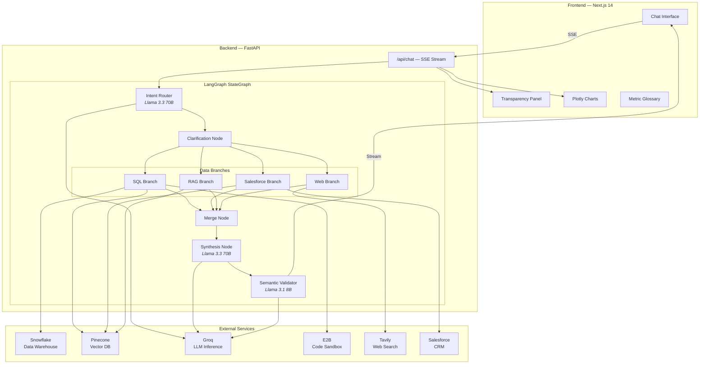
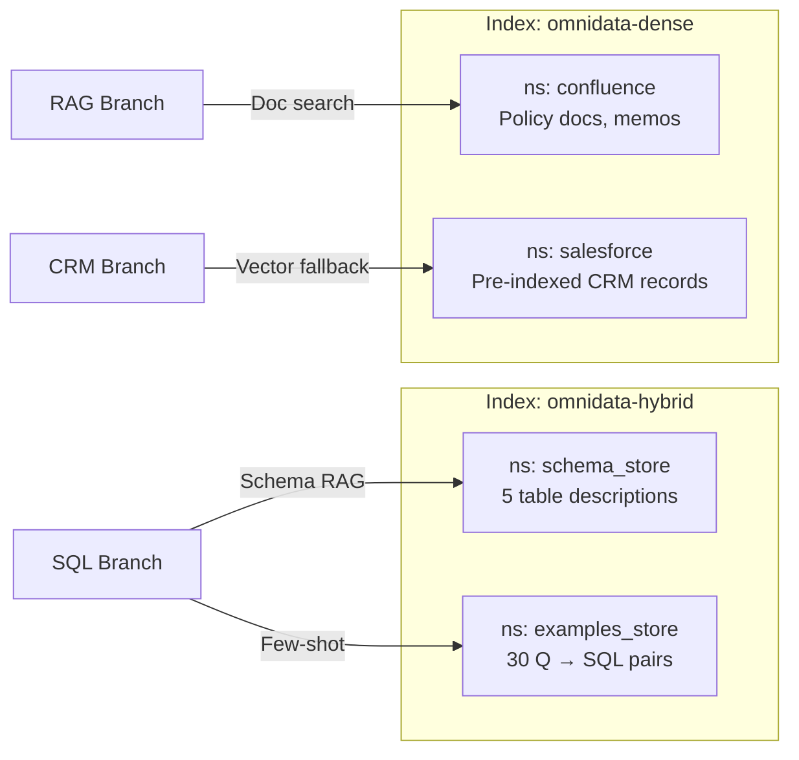

# 01 — System Overview

## High-Level Architecture

OmniData is a multi-agent AI platform that translates plain-English business questions into verified, jargon-free insights pulled from five enterprise data sources simultaneously.



## Tech Stack

| Layer | Technology | Role |
|-------|-----------|------|
| Frontend | Next.js 14, React 18, TypeScript | SSE streaming chat UI |
| Styling | Tailwind CSS 3, Material Symbols | Ethereal design system |
| Charts | Plotly.js (via E2B) | AI-generated visualizations |
| State | Zustand | Global state management |
| Backend | FastAPI, Uvicorn, Python 3.11 | REST + SSE server |
| Orchestration | LangGraph | Multi-agent pipeline |
| LLM | Groq (Llama 3.3 70B + 3.1 8B) | Intent, SQL, synthesis, validation |
| Vector DB | Pinecone Serverless (2 indexes) | Schema RAG, document retrieval, CRM |
| Warehouse | Snowflake (4 schemas, 4 tables) | Structured business data |
| Web Search | Tavily API | Live market intelligence |
| Sandbox | E2B | Secure Python code execution |
| Deploy | Google Cloud Run, Docker | Serverless containers |

## Data Flow Summary

1. **User** types a question in the chat UI
2. **SSE** connection opens to `/api/chat`
3. **Intent Router** classifies the question and selects branch(es)
4. **Clarification Node** resolves dates, metrics, and ambiguity
5. **Branches** execute sequentially: SQL → Salesforce → RAG → Web
6. **Merge Node** collects all branch outputs
7. **Synthesis Node** generates a unified natural-language narrative
8. **Semantic Validator** strips jargon from the response
9. **Frontend** renders the narrative, charts, data, and transparency tabs

## Pinecone Vector Architecture



## Snowflake Database Schema

```
OMNIDATA_DB
├── SALES
│   └── AURA_SALES          — 2,160 rows (Oct 2025 – Mar 2026)
├── PRODUCTS
│   └── PRODUCT_CATALOGUE   — 30 products
├── RETURNS
│   └── RETURN_EVENTS       — 450 return records
└── CUSTOMERS
    └── CUSTOMER_METRICS     — 72 monthly segment records
```
