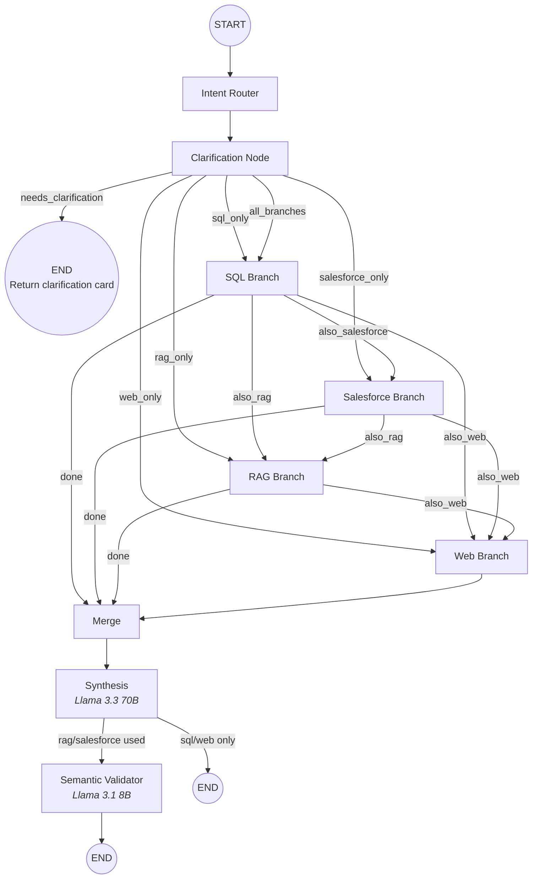
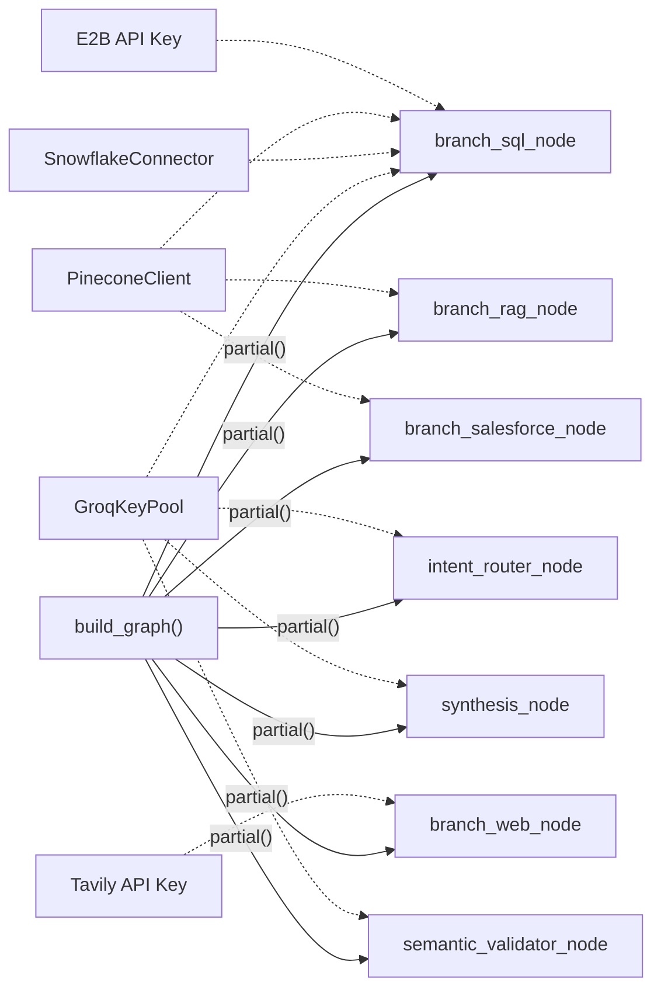

# 02 — LangGraph Pipeline

## Overview

OmniData's backend is orchestrated by a **LangGraph StateGraph** — a stateful, directed graph where each node is an async function that reads from and writes to a shared `GraphState` TypedDict. The pipeline uses **conditional edges** to dynamically route queries to the correct data branches.

## Pipeline Topology



## Sequential Chaining

Multi-branch queries do **not** execute in parallel. They follow a deterministic chain:

```
SQL → Salesforce → RAG → Web → Merge → Synthesis → Validator
```

Each routing function checks which branches are still pending:

| After Node | Routing Function | Checks | Next |
|-----------|-----------------|--------|------|
| `clarification` | `route_after_clarification()` | `state.branches` | First needed branch |
| `branch_sql` | `_route_after_sql()` | salesforce → rag → web | Next pending or `merge` |
| `branch_salesforce` | `_route_after_salesforce()` | rag → web | Next pending or `merge` |
| `branch_rag` | `_route_after_rag()` | web | Web or `merge` |
| `branch_web` | *(unconditional)* | — | Always `merge` |

## GraphState

The shared state object that flows through every node:

```python
class GraphState(TypedDict, total=False):
    # Input
    original_query: str
    resolved_query: str
    conversation_context: list

    # Routing
    branches: list[str]           # ["sql", "rag_confluence", "web"]
    sql_likely: bool
    rag_present: bool
    web_needed: bool
    salesforce_needed: bool

    # Clarification
    clarification_needed: bool
    clarification_options: list

    # Branch Outputs
    sql_output: dict              # SQL results, charts, confidence
    rag_output: dict              # Document matches with citations
    salesforce_output: dict       # CRM records
    web_output: dict              # Tavily search results

    # Synthesis
    final_response: str           # Natural language narrative
    follow_up_suggestions: list

    # Validation
    jargon_substitutions: list    # Audit log of term replacements
```

## Node Dependency Injection

All external dependencies (Groq, Snowflake, Pinecone, etc.) are injected via `functools.partial` at compile time in `build_graph()`. Nodes receive only the `GraphState` at runtime, keeping them stateless and testable.



## Semantic Validator Trigger

The Semantic Validator is **conditionally executed** — it only fires when unstructured sources (RAG or Salesforce) were used. Pure SQL or Web queries skip it, because those responses are already generated from clean data.

```python
def _route_after_synthesis(state):
    if state.get("rag_present") or state.get("salesforce_needed"):
        return "validate"   # Run jargon auditor
    return "skip"           # Go directly to END
```
