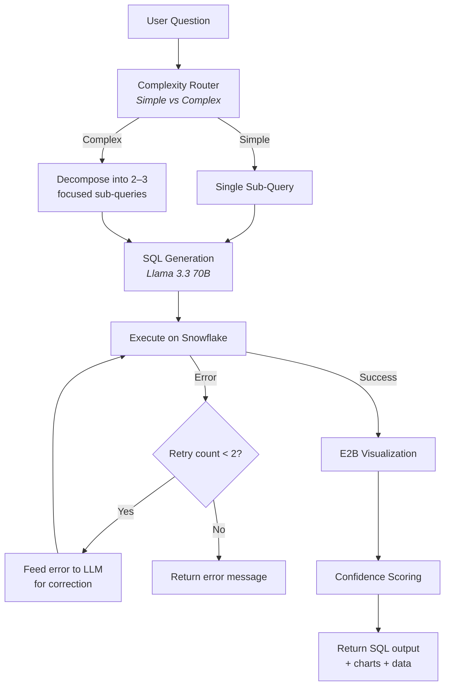
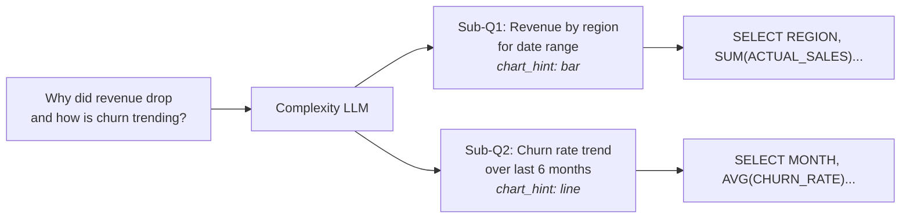
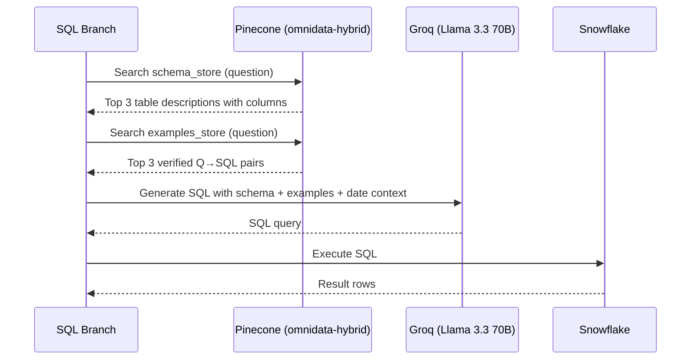
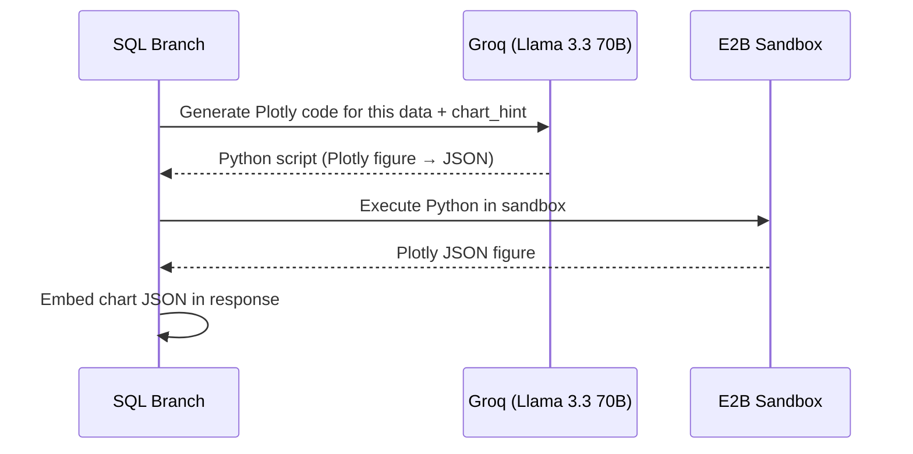

# 03 — SQL Branch & Snowflake

## Overview

The SQL Branch is OmniData's primary data engine. It translates natural-language questions into validated SQL, executes them against a live Snowflake warehouse, and generates AI-powered Plotly visualizations in an E2B sandbox.

## End-to-End Flow



## Query Decomposition

Complex multi-dimensional questions are broken down before SQL generation:



The LLM responds with a JSON payload:

```json
{
  "complexity": "complex",
  "reasoning": "Spans revenue and churn — two unrelated dimensions",
  "sub_queries": [
    {"question": "Revenue breakdown by region for Q1 2026", "chart_hint": "bar"},
    {"question": "Monthly churn rate trend Oct 2025 to Mar 2026", "chart_hint": "line"}
  ]
}
```

## Schema-Aware SQL Generation

Every SQL query is generated with full schema context retrieved from Pinecone:



## E2B Visualization Pipeline

After SQL returns data, an AI-generated Python script runs in an isolated E2B sandbox:



The generated visualizations use OmniData's branded color palette and are returned as Plotly JSON objects that the frontend renders interactively.

## Available Tables

| Table | Schema | Rows | Key Columns |
|-------|--------|------|-------------|
| `AURA_SALES` | `SALES` | 2,160 | `SALE_DATE`, `REGION`, `CHANNEL`, `PRODUCT_NAME`, `ACTUAL_SALES`, `UNITS_SOLD` |
| `PRODUCT_CATALOGUE` | `PRODUCTS` | 30 | `SKU`, `PRODUCT_NAME`, `CATEGORY`, `LIST_PRICE` |
| `RETURN_EVENTS` | `RETURNS` | 450 | `RETURN_DATE`, `PRODUCT_NAME`, `REGION`, `RETURN_REASON`, `RETURN_RATE` |
| `CUSTOMER_METRICS` | `CUSTOMERS` | 72 | `MONTH`, `REGION`, `SEGMENT`, `CHURN_RATE`, `REPEAT_PURCHASE_RATE` |

## Error Recovery

The SQL branch implements a retry loop with LLM-powered error correction:

1. **Attempt 1:** Execute generated SQL
2. **On failure:** Feed the Snowflake error message back to the LLM with the failed query
3. **Attempt 2:** LLM generates a corrected SQL query
4. **On failure:** Return a graceful error response with the error details
5. **Confidence impact:** Retry count feeds into the confidence score (1.0 → 0.5 → 0.0)
