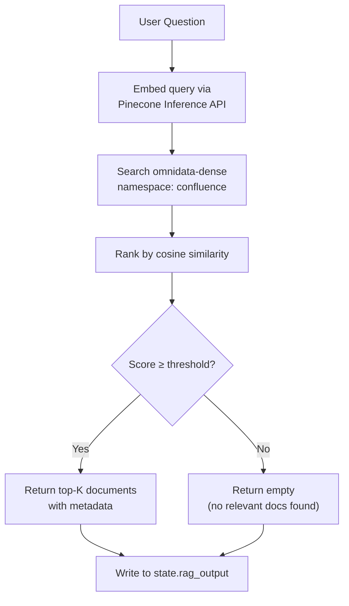
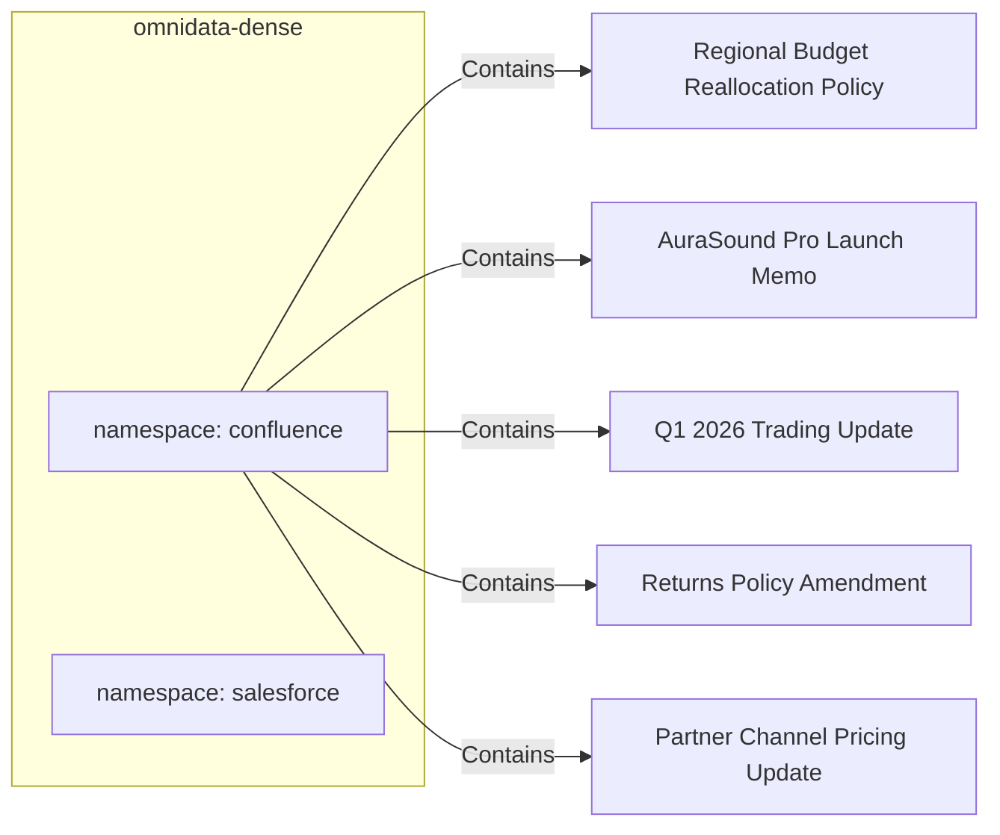

# 04 — RAG Branch & Knowledge Base

## Overview

The RAG (Retrieval-Augmented Generation) branch retrieves internal knowledge documents — policy pages, budget memos, product launch announcements — from Pinecone's `omnidata-dense` index and includes them as context for the synthesis node.

## Architecture



## Pinecone Index Layout



## Document Schema

Each document record in Pinecone contains:

```json
{
  "id": "conf-doc-001",
  "text": "The Regional Budget Reallocation Policy mandates that...",
  "metadata": {
    "title": "Regional Budget Reallocation Policy",
    "space": "AURA",
    "source": "confluence",
    "doc_type": "policy",
    "created_date": "2025-11-15"
  }
}
```

## Output Format

The branch returns a list of document matches to `state.rag_output`:

```json
{
  "documents": [
    {
      "title": "Regional Budget Reallocation Policy",
      "space": "AURA",
      "score": 0.87,
      "excerpt": "Marketing budget for South region was reduced by 40% effective January 2026..."
    }
  ],
  "source": "confluence_rag"
}
```

## Seeding

Documents are pre-indexed from Confluence source data using the `seed/confluence_seed.py` script. The seed script:

1. Reads document text from `seed/data/confluence_docs.json`
2. Embeds each document using Pinecone's integrated `multilingual-e5-large` model
3. Upserts records into `omnidata-dense/confluence` namespace

This allows the RAG branch to work without a live Confluence API connection — documents are always available via vector search.
