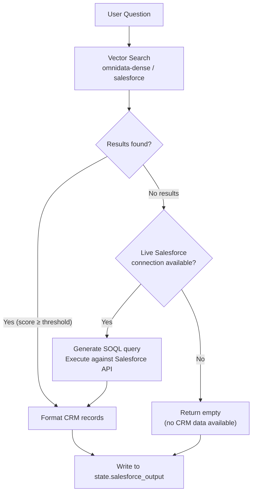
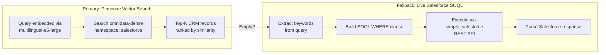

# 05 — Salesforce CRM Branch

## Overview

The Salesforce branch retrieves CRM data — accounts, opportunities, churn risk records — using a **vector-first, SOQL-fallback** architecture. Pinecone vector search is the primary retrieval method; live SOQL queries are attempted only when vector results are insufficient.

## Architecture

## Dual Retrieval Strategy

### Why Vector-First?

1. **Speed:** Pinecone returns results in ~50ms vs ~500ms for live SOQL
2. **Availability:** Works even when Salesforce credentials are not configured
3. **Pre-indexed:** All CRM records are seeded at deployment time
4. **Semantic matching:** Catches conceptually similar queries that keyword SOQL would miss

## Salesforce Connector

The `SalesforceConnector` class (`connectors/salesforce_connector.py`) provides:

| Method | Purpose |
|--------|---------|
| `query(soql)` | Execute a raw SOQL query |
| `describe_object(name)` | Get metadata for a Salesforce object |
| `is_connected()` | Check if the connection is active |

## Pre-Indexed CRM Records

The `seed/salesforce_seed.py` script indexes sample CRM data into Pinecone:

- **Accounts:** Company name, industry, region, annual revenue
- **Opportunities:** Deal stage, value, close date, probability
- **Cases:** Support tickets, resolution status, sentiment

Each record includes rich metadata for filtering and display in the Transparency Panel's CRM tab.
