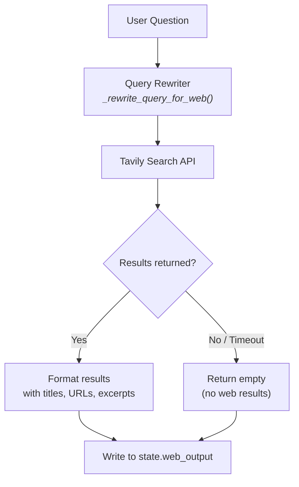
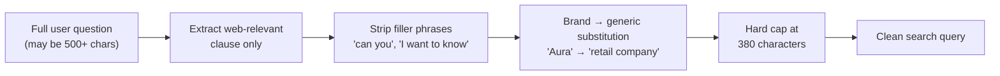

# 06 — Web Intelligence Branch

## Overview

The Web Branch performs real-time internet searches via the **Tavily Search API** to provide external context — competitor pricing, market benchmarks, industry trends — that internal data sources cannot answer.

## Architecture



## Query Rewriter

Raw user queries are often too long or contain internal jargon that web search engines can't parse. The `_rewrite_query_for_web()` function:



### Why 380 Characters?

The Tavily API enforces a **400-character query limit**. The rewriter caps at 380 to leave a safety margin for URL encoding.

### Example Transformations

| Input | Rewritten |
|-------|-----------|
| *"What is our Q1 churn rate, what do our internal exit surveys say, and how does our pricing compare to competitors right now?"* | *"retail company pricing compare to competitors"* |
| *"Can you tell me what the current industry benchmark for electronics return rates is?"* | *"industry benchmark electronics return rates"* |

## Tavily Integration

The branch uses the `tavily-python` SDK with these settings:

| Parameter | Value | Rationale |
|-----------|-------|-----------|
| `search_depth` | `"basic"` | Faster response time |
| `max_results` | `5` | Enough context without noise |
| `include_answer` | `True` | Get Tavily's summarized answer |
| `timeout` | `15s` | Prevent long hangs |

## Output Format

```json
{
  "web_results": [
    {
      "title": "UK Electronics Market Report Q1 2026",
      "url": "https://example.com/report",
      "content": "Average return rates in UK electronics retail...",
      "score": 0.92
    }
  ],
  "web_answer": "The industry average return rate for electronics is 12-15%...",
  "source": "tavily"
}
```
