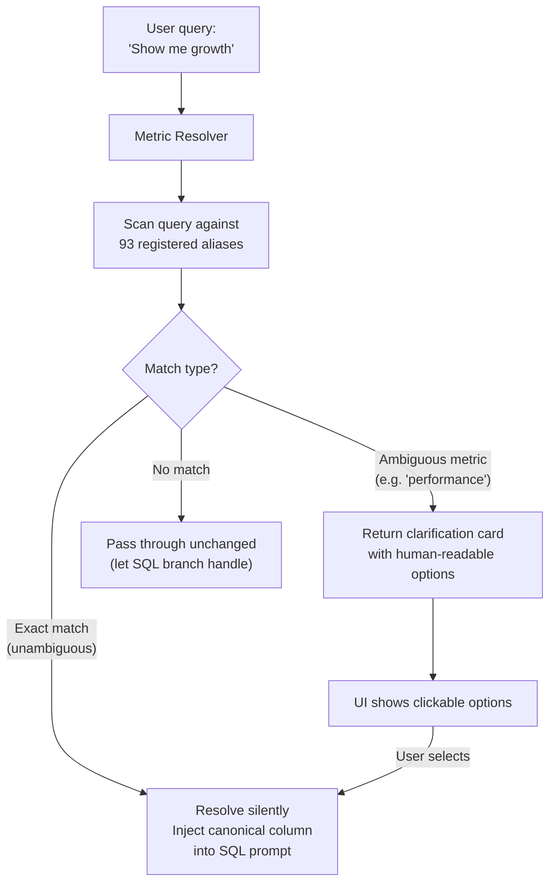
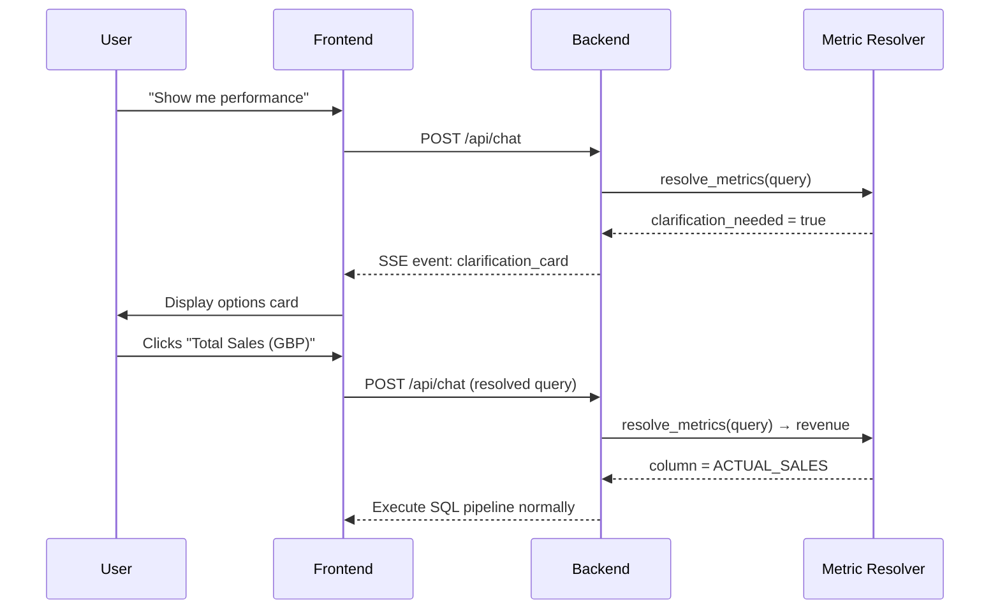
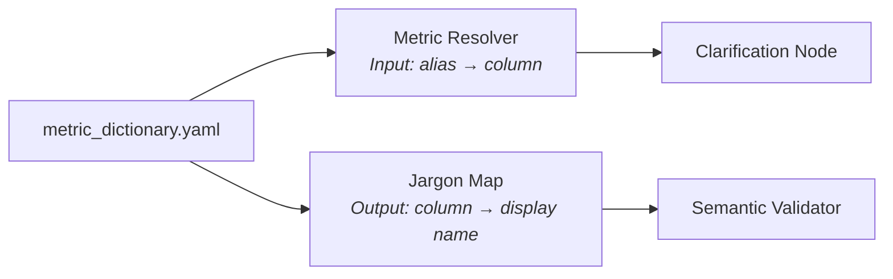

# 07 — Metric Dictionary & Clarification

## Overview

The Metric Dictionary is OmniData's **semantic layer** — a YAML-based mapping between natural-language business terms and canonical database columns. It powers three critical features: alias resolution, ambiguity detection, and jargon rewriting.

## Architecture



## Metric Dictionary Structure

Defined in `backend/src/config/metric_dictionary.yaml`:

```yaml
metrics:
  revenue:
    display_name: "Total Sales"
    column: "ACTUAL_SALES"
    unit: "GBP"
    description: "Total revenue in British Pounds"
    aliases:
      - "sales"
      - "revenue"
      - "money"
      - "income"
      - "earnings"
      - "turnover"
    ambiguous: false

  performance:
    display_name: null
    column: null
    description: "Ambiguous — could mean revenue, units, or churn"
    aliases:
      - "performance"
      - "results"
      - "numbers"
      - "KPIs"
      - "how are we doing"
    ambiguous: true
    clarification_options:
      - { label: "Total Sales (GBP)", metric: "revenue" }
      - { label: "Units Sold", metric: "units_sold" }
      - { label: "Customer Churn Rate", metric: "churn" }
```

## Current Metrics (12 total, 93 aliases)

| Key | Display Name | Column | Ambiguous |
|-----|-------------|--------|-----------|
| `revenue` | Total Sales | `ACTUAL_SALES` | No |
| `units_sold` | Units Sold | `UNITS_SOLD` | No |
| `churn` | Customer Churn Rate | `CHURN_RATE` | No |
| `return_rate` | Return Rate | `RETURN_RATE` | No |
| `repeat_purchase` | Repeat Purchase Rate | `REPEAT_PURCHASE_RATE` | No |
| `ad_spend` | Advertising Spend | `AD_SPEND` | No |
| `discounts` | Discount Amount | `DISCOUNT_AMOUNT` | No |
| `product_price` | List Price | `LIST_PRICE` | No |
| `new_customers` | New Customer Count | `NEW_CUSTOMERS` | No |
| `target_sales` | Target Sales | `TARGET_SALES` | No |
| `performance` | *(ambiguous)* | — | **Yes** |
| `growth` | *(ambiguous)* | — | **Yes** |

## Clarification Flow



## Temporal Resolution

The Clarification Node also resolves natural-language date references:

| Input | Resolved To |
|-------|-------------|
| "last quarter" | `Q1 2026 (January 1 – March 31, 2026)` |
| "Q4" | `Q4 2025 (October 1 – December 31, 2025)` |
| "this year" | `2026 (January 1 – present)` |
| "last month" | `March 2026` |
| "past 6 months" | `October 2025 – March 2026` |

## Dual Purpose

The Metric Dictionary serves both the **Clarification Node** (input resolution) and the **Semantic Validator** (output jargon removal). This ensures consistent terminology across the entire pipeline:


