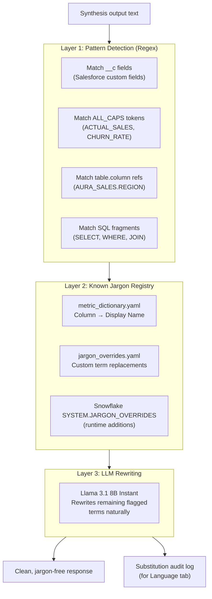
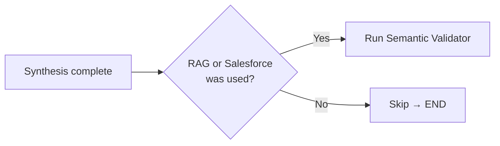

# 08 — Semantic Validator & Jargon Auditor

## Overview

The Semantic Validator is a **three-layer jargon detection and rewriting pipeline** that ensures every user-facing response uses plain business English. It fires only when RAG or Salesforce sources were used (where unstructured data may contain technical column names).

## Three-Layer Architecture



## Layer Details

### Layer 1: Pattern-Based Detection

Regex patterns scan the raw text for technical artifacts:

| Pattern | Catches | Example |
|---------|---------|---------|
| `\w+__c` | Salesforce custom fields | `Revenue__c` → flagged |
| `[A-Z_]{3,}` | ALL_CAPS columns | `ACTUAL_SALES` → flagged |
| `\w+\.\w+` | Qualified table refs | `AURA_SALES.REGION` → flagged |
| `SELECT\|WHERE\|JOIN` | SQL fragments | `WHERE REGION = 'North'` → flagged |

### Layer 2: Known Jargon Registry

Maps technical terms to business-friendly alternatives using two sources:

**Primary: `metric_dictionary.yaml`**
```
ACTUAL_SALES → "Total Sales"
CHURN_RATE → "Customer Churn Rate"
UNITS_SOLD → "Units Sold"
RETURN_RATE → "Return Rate"
```

**Secondary: `jargon_overrides.yaml`**
```yaml
overrides:
  REPEAT_PURCHASE_RATE: "Repeat Purchase Rate"
  AD_SPEND: "Advertising Spend"
  LIST_PRICE: "Product Price"
```

**Runtime: Snowflake `SYSTEM.JARGON_OVERRIDES` table**
- Admins can add new overrides at runtime without redeployment
- Synced on startup and on-demand via the dashboard

### Layer 3: LLM Rewriting

After layers 1 and 2 flag and replace known terms, the remaining text is sent to `Llama 3.1 8B Instant` with this prompt pattern:

```
Rewrite the following text to use plain business English.
Replace any remaining technical database terms with their
natural-language equivalents. Do not change the meaning or data.
```

## Substitution Audit Log

Every replacement is logged and returned to the frontend:

```json
{
  "substitutions": [
    {
      "original": "ACTUAL_SALES",
      "replacement": "Total Sales",
      "layer": "registry",
      "location": "paragraph 1, sentence 2"
    },
    {
      "original": "CHURN_RATE",
      "replacement": "Customer Churn Rate",
      "layer": "regex",
      "location": "paragraph 2, sentence 1"
    }
  ]
}
```

This log is displayed in the **Language tab** of the Transparency Panel, giving judges and users full visibility into what was changed and why.

## Conditional Execution



Pure SQL and Web queries skip the validator because their responses are generated from clean, structured data that doesn't contain Salesforce `__c` fields or unstructured document fragments.
