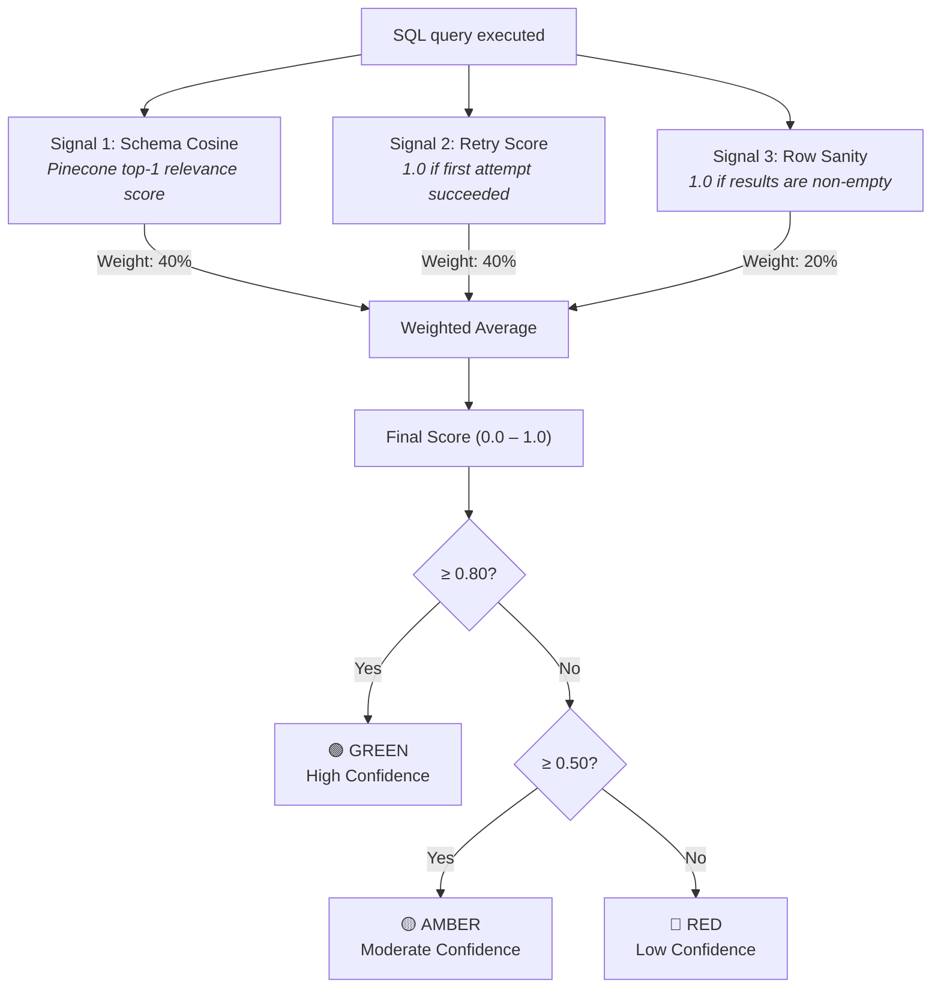

# 09 — Confidence Scoring

## Overview

Every SQL query response includes a **three-signal confidence score** that quantifies how trustworthy the answer is. The score drives a traffic-light tier system (Green / Amber / Red) displayed in the Transparency Panel.

## Scoring Architecture



## Signal Details

### Signal 1: Schema Cosine Relevance (40%)

The Pinecone `schema_store` returns a cosine similarity score for how well the user's question matches the table descriptions used to generate SQL.

| Score Range | Meaning |
|-------------|---------|
| ≥ 0.75 | Strong match — correct tables identified |
| 0.50 – 0.74 | Moderate — penalized to 60% of raw score |
| < 0.50 | Weak match — query may target wrong tables |

### Signal 2: Retry Score (40%)

Reflects how many attempts were needed to generate valid SQL:

| Retries | Score | Interpretation |
|---------|-------|----------------|
| 0 | 1.0 | SQL worked on the first try |
| 1 | 0.5 | Needed one correction |
| 2+ | 0.0 | Multiple failures — low trust |

### Signal 3: Row Sanity (20%)

Checks whether the query returned any data:

| Condition | Score | Reasoning |
|-----------|-------|-----------|
| Rows > 0 | 1.0 | Data exists for this query |
| Rows = 0, aggregate query | 0.5 | Possible valid empty result |
| Rows = 0, non-aggregate | 0.2 | Likely incorrect query |

## Example Calculations

### High Confidence (Green)
```
Pinecone score: 0.91 → signal = 0.91
Retry count: 0     → signal = 1.0
Row count: 12      → signal = 1.0

Score = 0.91(0.4) + 1.0(0.4) + 1.0(0.2) = 0.364 + 0.4 + 0.2 = 0.964
Tier: GREEN ✅
```

### Moderate Confidence (Amber)
```
Pinecone score: 0.68 → signal = 0.68 × 0.6 = 0.408
Retry count: 1     → signal = 0.5
Row count: 5       → signal = 1.0

Score = 0.408(0.4) + 0.5(0.4) + 1.0(0.2) = 0.163 + 0.2 + 0.2 = 0.563
Tier: AMBER ⚠️
```

### Low Confidence (Red)
```
Pinecone score: 0.45 → signal = 0.45 × 0.6 = 0.27
Retry count: 2     → signal = 0.0
Row count: 0       → signal = 0.2

Score = 0.27(0.4) + 0.0(0.4) + 0.2(0.2) = 0.108 + 0.0 + 0.04 = 0.148
Tier: RED ❌
```

## Frontend Display

The confidence score is shown in the **CONF.** tab of the Transparency Panel with:

- A color-coded badge (Green / Amber / Red)
- The numeric score as a percentage
- A breakdown of all three signals
- A plain-English explanation of what the score means
