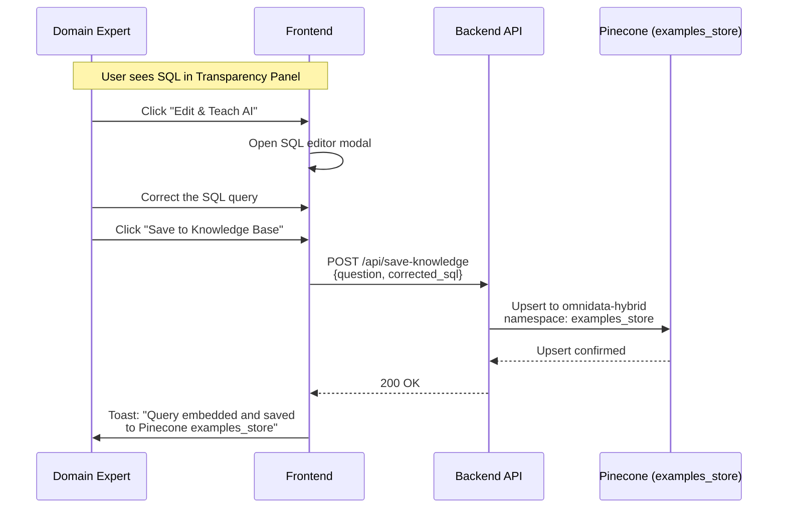
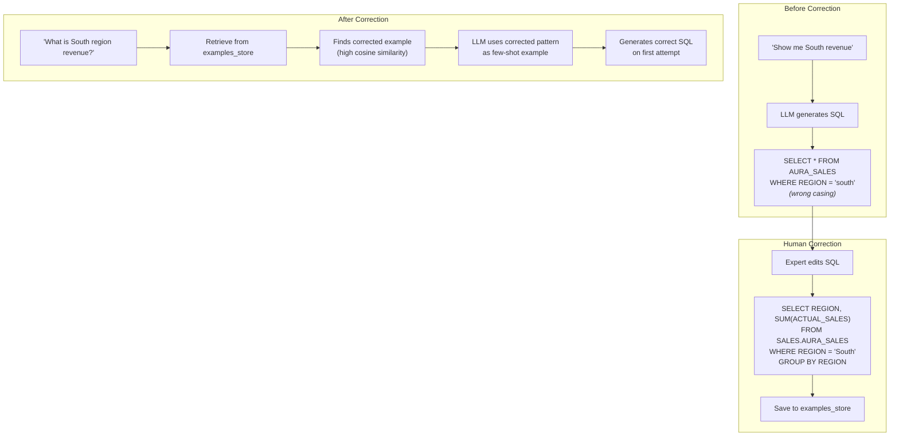
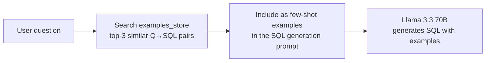

# 10 — Self-Healing SQL

## Overview

Self-Healing SQL is OmniData's **human-in-the-loop learning system**. When a domain expert spots an incorrect or suboptimal SQL query in the Transparency Panel, they can edit it and save the correction to Pinecone's `examples_store`. Future similar questions automatically retrieve the corrected pattern, making the system smarter with every human correction.

## Architecture



## Learning Loop



## How It Integrates with SQL Generation

The SQL Branch retrieves examples from Pinecone's `examples_store` namespace before generating SQL:



When a human-corrected example is saved, it becomes part of this retrieval pool. Because Pinecone ranks by semantic similarity, the corrected example naturally surfaces for similar future queries.

## Record Schema

Each Q→SQL pair in `examples_store`:

```json
{
  "id": "example-custom-001",
  "text": "Show me South region revenue breakdown",
  "metadata": {
    "sql": "SELECT REGION, SUM(ACTUAL_SALES) as TOTAL_REVENUE FROM SALES.AURA_SALES WHERE REGION = 'South' GROUP BY REGION",
    "source": "human_correction",
    "created_at": "2026-04-19T10:30:00Z",
    "tables": ["AURA_SALES"]
  }
}
```

## Frontend UI

The self-healing workflow is accessible directly from the SQL tab:

1. **"Edit & Teach AI" button** — Opens a modal with the SQL in an editable textarea
2. **SQL Editor** — User corrects the query
3. **"Save to Knowledge Base" button** — Sends the correction to the API
4. **Success toast** — Confirms the correction was embedded and saved

This creates a continuous improvement loop where the system gets better with use — without requiring any code changes or redeployment.
