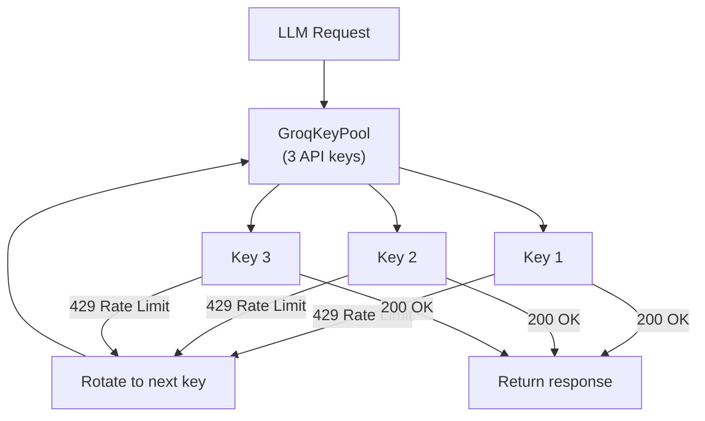
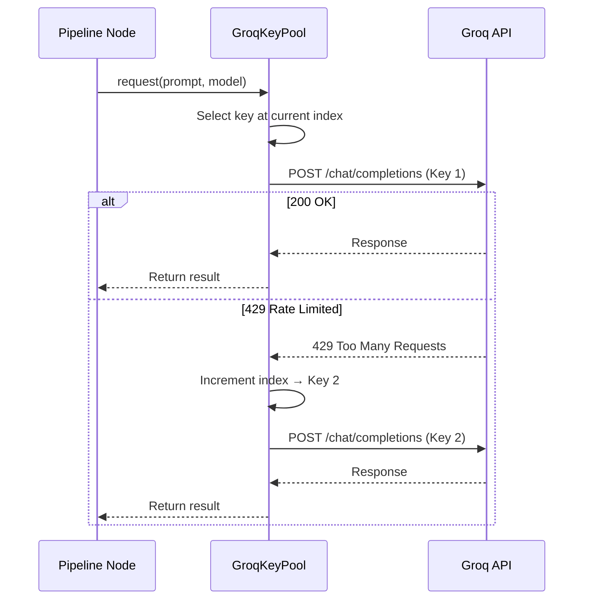

# 11 — Groq Key Pool & Resilience

## Overview

OmniData uses **Groq** for all LLM inference (Llama 3.3 70B for intent routing, SQL generation, and synthesis; Llama 3.1 8B for semantic validation). To handle rate limits under concurrent usage, the system implements a **rotating key pool with automatic 429 retry logic**.

## Key Pool Architecture



## Rotation Logic



## Key Distribution

The pipeline makes multiple LLM calls per query. The key pool distributes load:

| Node | Model | Calls per Query |
|------|-------|----------------|
| Intent Router | Llama 3.3 70B | 1 |
| Complexity Router | Llama 3.3 70B | 1 |
| SQL Generation | Llama 3.3 70B | 1–3 (retries) |
| Chart Generation | Llama 3.3 70B | 1 per sub-query |
| Synthesis | Llama 3.3 70B | 1 |
| Semantic Validator | Llama 3.1 8B | 0–1 (conditional) |

**Total per complex query:** 5–8 LLM calls, distributed across 3 API keys.

## Configuration

Keys are loaded from environment variables:

```env
GROQ_API_KEY_1=gsk_xxxxxxxxxxxxxxxxxxxx
GROQ_API_KEY_2=gsk_xxxxxxxxxxxxxxxxxxxx
GROQ_API_KEY_3=gsk_xxxxxxxxxxxxxxxxxxxx
```

The pool initializes at startup:

```python
pool = GroqKeyPool([
    os.getenv("GROQ_API_KEY_1"),
    os.getenv("GROQ_API_KEY_2"),
    os.getenv("GROQ_API_KEY_3"),
])
```

## Resilience Features

| Feature | Implementation |
|---------|---------------|
| **Round-robin rotation** | Keys cycle sequentially on each call |
| **429 auto-retry** | Automatically switches to the next key on rate limit |
| **Graceful degradation** | If all keys are exhausted, returns an error message instead of crashing |
| **Startup validation** | Logs the number of valid keys on boot: `Groq pool: 3 keys` |
